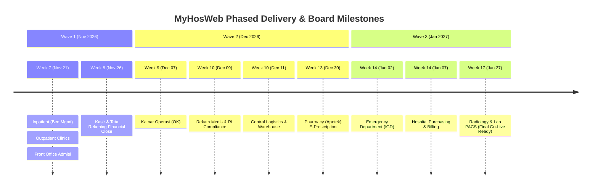
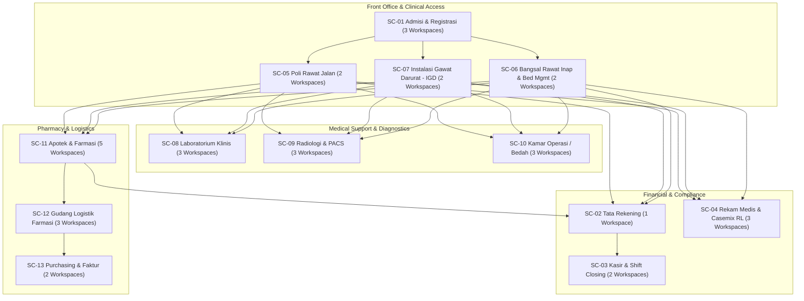
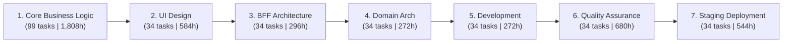

# Executive Summary: MyHosWeb System Implementation (Rev 5)
**Document Type:** Board of Directors Briefing  
**System:** MyHosWeb Integrated Hospital Information System (SIMRS)  
**Baseline Schedule:** 6-Day Work Week Model (Monday – Saturday, 8 Hours/Day)  
**Date of Report:** October 7, 2026  

---

## 1. Executive Snapshot & Strategic Overview

The **MyHosWeb System** represents the next-generation digital healthcare operations backbone, integrating outpatient, inpatient, emergency, diagnostic, pharmacy, inventory, billing, and procurement into a unified web-native architecture.

Following the adoption of an accelerated **6-day working calendar (48 hours/week)**, the engineering implementation roadmap has been compressed by **over 5 weeks**, targeting full system readiness by **late January 2027** instead of March 2027.

| Key Metric | Value | Executive Commentary |
| :--- | :--- | :--- |
| **Project Kickoff** | **October 12, 2026** | Initial booking sprint active since Sept 22; full 9 streams kick off Oct 12 |
| **System Completion Date** | **January 27, 2027** | Final stream (Radiology Local Inventory) completes staging & deployment |
| **Total Engineering Duration** | **15.5 Weeks (~3.8 Months)** | High-concurrency parallel delivery across 9 dedicated workstreams |
| **Total Engineering Effort** | **8,912 Person-Hours** | Equivalent to **1,114 Man-Days** across 337 structured work packages |
| **Operational Workspaces** | **34 Workspaces** | Spanning 13 hospital departments and clinical/financial functions |
| **Engineering Capacity** | **9 Domain Leads / Engineers** | Single-responsibility allocation per hospital stream to eliminate thrashing |

---

## 2. Functional Scope: 13 Hospital Operational Modules

The project is structured into **34 operational workspaces** across **13 core hospital departments**:

### Module Breakdown Summary

| Code | Department / Domain | Workspaces | Effort (Days) | Key Business Deliverables |
| :--- | :--- | :---: | :---: | :--- |
| **SC-01** | **Admisi & Registrasi** | 3 | 54.0 | Booking, Reg Rajal-IGD, Reg Ranap, Vclaim BPJS |
| **SC-02** | **Tata Rekening** | 1 | 16.0 | Billing summary, discharge invoicing, claim consolidation |
| **SC-03** | **Kasir** | 2 | 24.0 | Payment settlement, multiple payment gateways, shift balancing |
| **SC-04** | **Rekam Medis & Casemix** | 3 | 51.0 | EMR folder tracking, ICD-10/ICD-9CM coding, Kemenkes RL reporting |
| **SC-05** | **Poli Rawat Jalan** | 2 | 36.0 | Clinical encounters, nurse triage, local inventory usage |
| **SC-06** | **Bangsal Rawat Inap** | 2 | 36.0 | Real-time bed occupancy, room transfer, nurse station inventory |
| **SC-07** | **Instalasi Gawat Darurat** | 2 | 36.0 | ATS/ESI triage categorization, emergency rapid response flow |
| **SC-08** | **Laboratorium** | 3 | 48.0 | Test order routing, analyzer interfaces, digital results verification |
| **SC-09** | **Radiologi & Imaging** | 3 | 45.0 | Exam orders, DICOM/PACS expertise reporting, film inventory |
| **SC-10** | **Kamar Operasi (OK)** | 3 | 49.0 | Surgical scheduling, pre/intra/post-op records, surgical implants |
| **SC-11** | **Apotek & Farmasi** | 5 | 69.0 | E-Prescription audit, compounding/dispensing, drug verification |
| **SC-12** | **Gudang Logistik** | 3 | 53.0 | Delivery orders (DO), stock batch/expiry tracking, purchase returns |
| **SC-13** | **Purchasing & AP** | 2 | 40.0 | Automated Purchase Orders (PO), vendor invoicing & verification |

---

## 3. Engineering Rigor & Delivery Lifecycle

Every workspace follows an identical **7-stage quality gating lifecycle**, ensuring uniform enterprise compliance, security, and traceability:

* **Core Feature Modeling (20.3% of effort)**: Establishes domain boundaries, data models, and business invariants before code is written.
* **Architecture & UI/BFF (13.0% of effort)**: Guarantees modular component reuse and microservice alignment.
* **Testing & Quality Assurance (7.6% of dedicated QA)**: Formal unit, integration, and user scenario testing prior to staging sign-off.
* **Automated Staging Deployment (6.1% of effort)**: Verifies CI/CD pipeline readiness and infrastructure configurations.

---

## 4. Human Capital Allocation & Resource Load

The workload is distributed among 9 dedicated engineers. The parallelization strategy ensures zero cross-stream blocking dependencies while maintaining clear ownership:

| Resource | Primary Domain Assigned | Work Packages | Man-Days | Hours | Target Finish Date |
| :--- | :--- | :---: | :---: | :---: | :---: |
| **We** | Diagnostics (Lab & Radiologi) | 52 | 186.0 | 1,488 | **Jan 27, 2027** *(Critical Path)* |
| **Arif** | Front Office (Admisi & IGD) | 52 | 180.0 | 1,440 | **Jan 02, 2027** |
| **Fikri** | Outpatient & Purchasing | 36 | 152.0 | 1,216 | **Jan 07, 2027** |
| **Jude** | Pharmacy & E-Prescription | 44 | 138.0 | 1,104 | **Dec 30, 2026** |
| **Roso** | Warehouse & Logistics | 26 | 106.0 | 848 | **Dec 11, 2026** |
| **Rizal** | Medical Records & Compliance | 23 | 102.0 | 816 | **Dec 09, 2026** |
| **Arie** | Operating Theaters (OK) | 27 | 98.0 | 784 | **Dec 07, 2026** |
| **Erkoc** | Cashier & Revenue Billing | 22 | 80.0 | 640 | **Nov 26, 2026** |
| **Sulis** | Inpatient & Bed Management | 21 | 72.0 | 576 | **Nov 21, 2026** |
| **Total** | **Full Engineering Team** | **303** | **1,114.0** | **8,912** | **Jan 27, 2027** |

> [!NOTE]
> **Resource Rebalancing Opportunity**:  
> Engineers **Sulis** (Nov 21) and **Erkoc** (Nov 26) complete their primary deliverables early. Their remaining capacity will be strategically redeployed to assist **We** (Diagnostics stream) and support Hospital User Acceptance Testing (UAT) and staff training.

---

## 5. Strategic Milestones for Board Governance

The Board of Directors can monitor program execution against **3 definitive Governance Gates**:

### Gate 1: Front Office & Hospital Cashier Readiness (November 26, 2026)
* **Scope**: Admisi (Rajal/Ranap), Rawat Jalan, Bed Management Inpatient, and Cashier Closing.
* **Business Value**: The hospital's patient registration, outpatient clinic consultation, and revenue collection loops are fully digitized.
* **Success Criteria**: End-to-end patient encounter test from registration to invoice generation without manual intervention.

### Gate 2: Supply Chain & Medical Record Compliance (December 30, 2026)
* **Scope**: Pharmacy (Apotek), Logistics Warehouse, Surgical Theaters, and Medical Record RL Reporting.
* **Business Value**: Full medication dispensing controls, stock safety limits, operating theater scheduling, and Kemenkes regulatory compliance.
* **Success Criteria**: Automated stock deductions on dispensing and zero discrepancy in casemix coding exports.

### Gate 3: Final Hospital Cutover Readiness (January 27, 2027)
* **Scope**: Laboratory analyzer interfacing, Radiology PACS reporting, and Procurement invoicing.
* **Business Value**: All diagnostic and procurement loops closed. Entire hospital system enters final End-to-End Simulation and Production Cutover.
* **Success Criteria**: Diagnostic imaging result dispatch directly to EMR within 60 seconds; 100% test scenario pass rate.

---

## 6. Key Risks & Mitigation Measures

| Risk Area | Severity | Impact | Mitigation Strategy |
| :--- | :---: | :--- | :--- |
| **Diagnostics Critical Path** | **High** | Engineer `We` holds 1,488 hours ending Jan 27. Any slippage delays project cutover. | Pair with `Sulis` or `Erkoc` starting late November to accelerate Radiologi module delivery. |
| **Third-Party Integrations** | **Medium** | Delays in BPJS V-Claim API / PACS modality connectivity could block acceptance. | Mock service virtualization is embedded in Phase 3 (BFF Feature) before live API binding. |
| **Team Fatigue (6-Day Week)** | **Medium** | Accelerated 48-hour work weeks could impact team velocity if sustained without respite. | Milestone rest buffers scheduled immediately following Wave 1 (Nov) and Wave 2 (Dec) completions. |
| **User Change Management** | **Low-Medium** | Clinical staff adaptation across 13 departments during rollout. | Roll off early finishing engineers (`Sulis`, `Erkoc`, `Arie`) to lead clinical simulation and user training. |

---

## 7. Board Recommendation & Sign-Off

1. **Approve Baseline Schedule**: Ratify the baseline completion date of **January 27, 2027** under the 6-day work calendar model.
2. **Authorize Cross-Stream Reallocation**: Approve the planned transition of early-completing engineers to UAT facilitation and critical-path acceleration in December 2026.
3. **Establish Bi-Weekly Governance**: Schedule bi-weekly Board oversight briefings aligned with Gate 1 (Nov 26), Gate 2 (Dec 30), and Gate 3 (Jan 27).
