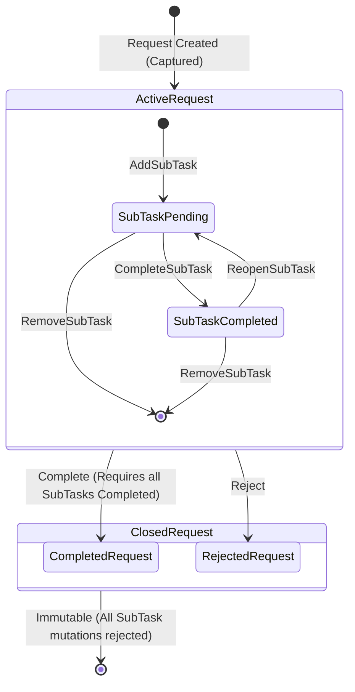

# 1. Overview

This architecture defines the authoritative technical realization for Change Request `CR-006`: **Request Sub-Tasks Breakdown and Completion Progress Tracking**.

It realizes the business requirements and approved decisions from [CR-006-FEASIBILITY-ASSESSMENT.md](file:///d:/Project.Aktif/b20-agentic-dev/cakra/docs/analysis/CR-006-FEASIBILITY-ASSESSMENT.md), [CR-006-ISSUE.md](file:///d:/Project.Aktif/b20-agentic-dev/cakra/docs/issues/CR-006-ISSUE.md), [request-domain.md](file:///d:/Project.Aktif/b20-agentic-dev/cakra/docs/domains/request-domain.md), [FEAT-REQ-001-record-customer-request.md](file:///d:/Project.Aktif/b20-agentic-dev/cakra/docs/features/FEAT-REQ-001-record-customer-request.md), [FEAT-REQ-008-review-request-completion.md](file:///d:/Project.Aktif/b20-agentic-dev/cakra/docs/features/FEAT-REQ-008-review-request-completion.md), and [FEAT-COL-004-review-assigned-requests.md](file:///d:/Project.Aktif/b20-agentic-dev/cakra/docs/features/FEAT-COL-004-review-assigned-requests.md).

It establishes an encapsulated child entity collection (`RequestSubTask`) within the authoritative `Request` aggregate root, persists sub-tasks in a normalized table `[request].[RequestSubTasks]` with cascading referential integrity, stores summary counters and completion percentage directly on `[request].[Requests]`, enforces a strict blocking domain invariant that prevents completing a Request while incomplete sub-tasks exist, implements role- and assignee-based authorization, publishes domain events for change auditing, introduces CQRS application commands, extends query projections, and provides an interactive checklist UI with progress visualization across `Cakra.Web`.

---

# 2. Architectural Basis

## Business Context

- DOMAIN: [request-domain.md](file:///d:/Project.Aktif/b20-agentic-dev/cakra/docs/domains/request-domain.md)
- DOMAIN: [organization-domain.md](file:///d:/Project.Aktif/b20-agentic-dev/cakra/docs/domains/organization-domain.md)
- FEATURE: [FEAT-REQ-001-record-customer-request.md](file:///d:/Project.Aktif/b20-agentic-dev/cakra/docs/features/FEAT-REQ-001-record-customer-request.md)
- FEATURE: [FEAT-REQ-008-review-request-completion.md](file:///d:/Project.Aktif/b20-agentic-dev/cakra/docs/features/FEAT-REQ-008-review-request-completion.md)
- FEATURE: [FEAT-COL-004-review-assigned-requests.md](file:///d:/Project.Aktif/b20-agentic-dev/cakra/docs/features/FEAT-COL-004-review-assigned-requests.md)
- ISSUE: [CR-006-ISSUE.md](file:///d:/Project.Aktif/b20-agentic-dev/cakra/docs/issues/CR-006-ISSUE.md)
- SYSTEM ARCHITECTURE: [CAKRA-ARCHITECTURE.md](file:///d:/Project.Aktif/b20-agentic-dev/cakra/docs/architecture/CAKRA-ARCHITECTURE.md)

## Analysis Input

- FEASIBILITY ASSESSMENT: [CR-006-FEASIBILITY-ASSESSMENT.md](file:///d:/Project.Aktif/b20-agentic-dev/cakra/docs/analysis/CR-006-FEASIBILITY-ASSESSMENT.md) (Status: `READY-FOR-PLANNING`)

This architecture consumes and realizes the approved feasibility decisions:
- `GAP-001` & `OQ-001`: Child entity `RequestSubTask` encapsulated within `Request` aggregate root; `Request.Complete` enforces zero incomplete sub-tasks via `RequestHasUnfinishedSubTasksException`.
- `GAP-002` & `OQ-005`: Normalized table `[request].[RequestSubTasks]` with cascading foreign key; `[TotalSubTasksCount]`, `[CompletedSubTasksCount]`, and `[CompletionPercentage]` columns added to `[request].[Requests]`.
- `GAP-003` & `OQ-007`: Dedicated commands (`AddRequestSubTaskCommand`, `CompleteRequestSubTaskCommand`, `ReopenRequestSubTaskCommand`, `RemoveRequestSubTaskCommand`) plus optional initial sub-task list in `RecordRequestCommand`.
- `GAP-004`: Domain events `RequestSubTaskAdded`, `RequestSubTaskCompleted`, `RequestSubTaskReopened`, and `RequestSubTaskRemoved`.
- `GAP-005` & `OQ-006`: Dual-tier authorization: management/owner roles manage sub-tasks; assigned collaborator or owner/manager can complete or reopen tasks.
- `GAP-006` & `OQ-004`: Dynamic completion percentage formula: `(CompletedSubTasksCount / TotalSubTasksCount) * 100`, or `100` if `Completed` with 0 sub-tasks, else `0`.
- `GAP-007` & `OQ-008`: `RequestDto` enriched with sub-task items and summary metrics; personal queue query filtering by assigned sub-tasks.
- `GAP-008`: Vue 3 interactive checklist card, progress bar (`60% (3/5)`), and personal workspace views.
- `GAP-009`: Domain and feature documentation synchronization.
- `OQ-002` & `OQ-003`: Active states only for mutations; immutable once `Completed` or `Rejected`; reopening permitted while active.

---

# 3. Scope

## Included

1. **Domain Model (`Cakra.Modules.Request.Domain`)**:
   - Entity [`RequestSubTask`](file:///d:/Project.Aktif/b20-agentic-dev/cakra/src/backend/Cakra.Modules.Request/Domain/RequestSubTask.cs) with properties `Id`, `RequestId`, `Title`, `IsCompleted`, `AssigneePersonId`, `CompletedAt`, `CompletedByPersonId`, `SortOrder`, `CreatedAt`, `UpdatedAt`.
   - Aggregate Root [`Request`](file:///d:/Project.Aktif/b20-agentic-dev/cakra/src/backend/Cakra.Modules.Request/Domain/Request.cs) encapsulation:
     - `IReadOnlyCollection<RequestSubTask> SubTasks => _subTasks.AsReadOnly();`
     - `int TotalSubTasksCount`, `int CompletedSubTasksCount`, `int CompletionPercentage`.
     - Domain methods: `AddSubTask(...)`, `CompleteSubTask(...)`, `ReopenSubTask(...)`, `RemoveSubTask(...)`.
     - Strict guard in `Complete(...)`: throws `RequestHasUnfinishedSubTasksException` if `_subTasks.Any(t => !t.IsCompleted)`.
     - State validation guard: throws `InvalidRequestStateTransitionException` if any sub-task modification is attempted when `Status` is `Completed` or `Rejected`.
   - Domain events in `Cakra.Modules.Request.Domain.Events`:
     - `RequestSubTaskAdded`, `RequestSubTaskCompleted`, `RequestSubTaskReopened`, `RequestSubTaskRemoved`.
   - Custom domain exception `RequestHasUnfinishedSubTasksException`.

2. **Application & Service Layer (`Cakra.Modules.Request.Services`)**:
   - Commands & Validators in `RequestCommands.cs`:
     - `AddRequestSubTaskCommand(Guid RequestId, string Title, Guid? AssigneePersonId, Guid? ActorPersonId)`
     - `CompleteRequestSubTaskCommand(Guid RequestId, Guid SubTaskId, Guid? ActorPersonId)`
     - `ReopenRequestSubTaskCommand(Guid RequestId, Guid SubTaskId, Guid? ActorPersonId)`
     - `RemoveRequestSubTaskCommand(Guid RequestId, Guid SubTaskId, Guid? ActorPersonId)`
     - Extended `RecordRequestCommand` accepting optional `IReadOnlyList<InitialSubTaskDto>? InitialSubTasks`.
   - Service handlers in `RequestService.cs` with authorization logic:
     - Verifying Request Owner or Management roles (`Programmer`, `Administrator`, `Team Lead`, `Manager`) for adding, removing, and reassigning sub-tasks.
     - Verifying Sub-Task Assignee, Request Owner, or Management roles for completing or reopening a sub-task.
   - Query extensions in `RequestQueryService.cs` to filter requests containing sub-tasks assigned to a specific `PersonId`.
   - Data transfer objects in `Cakra.Modules.Request.Models`:
     - `RequestSubTaskDto` and extended `RequestDto`.

3. **Persistence & Database Migration (`Cakra.Modules.Request.Persistence`, `Cakra.Api`)**:
   - Database migration script `0014_add_request_subtasks.sql`:
     - Creates table `[request].[RequestSubTasks]` with foreign key `FK_RequestSubTasks_Requests` (`ON DELETE CASCADE`) and indexes.
     - Alters `[request].[Requests]` adding `[TotalSubTasksCount]`, `[CompletedSubTasksCount]`, and `[CompletionPercentage]`.
     - Backfills historical records (`TotalSubTasksCount = 0`, `CompletedSubTasksCount = 0`, `CompletionPercentage = CASE WHEN Status = 'COMPLETED' THEN 100 ELSE 0 END`).
   - Repository persistence in [`RequestRepository.cs`](file:///d:/Project.Aktif/b20-agentic-dev/cakra/src/backend/Cakra.Modules.Request/Persistence/RequestRepository.cs):
     - Loads sub-tasks during `GetByIdAsync`.
     - Persists new, updated, and deleted sub-tasks and synchronizes parent progress columns within an atomic transaction.

4. **API Gateway & Controllers (`Cakra.Api.Controllers`)**:
   - `POST /api/v1/requests/{id}/subtasks` -> `AddRequestSubTaskCommand`
   - `POST /api/v1/requests/{id}/subtasks/{subTaskId}/complete` -> `CompleteRequestSubTaskCommand`
   - `POST /api/v1/requests/{id}/subtasks/{subTaskId}/reopen` -> `ReopenRequestSubTaskCommand`
   - `DELETE /api/v1/requests/{id}/subtasks/{subTaskId}` -> `RemoveRequestSubTaskCommand`
   - Updated `POST /api/v1/requests` accepting initial sub-tasks.

5. **Frontend Application (`Cakra.Web`)**:
   - `RequestDetailView.vue`: Interactive checklist card (one-click toggle, inline task input, assignee selector, delete action, completion guard tooltip).
   - `RequestListView.vue`: Progress column showing progress bar with `60% (3/5)`.
   - `CreateRequestView.vue`: Dynamic sub-task input list.
   - `MyRequestsView.vue`: "Assigned Sub-Tasks" section surfacing tasks assigned to the current user with direct toggle action.

## Excluded

- Standalone project management board or Gantt charts.
- Sub-tasks within sub-tasks (nested sub-tasks or multi-level hierarchies).
- Time-tracking / hour estimates per sub-task.
- Cross-request dependencies between sub-tasks.

---

# 4. Technical Decisions

## TD-001: Encapsulated Child Entity within Request Aggregate Root
Sub-tasks are modeled as child entities (`RequestSubTask`) belonging strictly to the `Request` aggregate root.
- The `Request` aggregate root maintains an internal `List<RequestSubTask> _subTasks` and exposes it via `IReadOnlyCollection<RequestSubTask> SubTasks`.
- External code cannot mutate `_subTasks` directly; all additions, completions, reopenings, and removals must execute through aggregate methods (`Request.AddSubTask`, `Request.CompleteSubTask`, `Request.ReopenSubTask`, `Request.RemoveSubTask`).
- This guarantees aggregate boundary consistency and guarantees that parent progress counters are recalculated atomically.

```csharp
public sealed class RequestSubTask : EntityBase
{
    public Guid RequestId { get; private set; }
    public string Title { get; private set; } = string.Empty;
    public bool IsCompleted { get; private set; }
    public Guid? AssigneePersonId { get; private set; }
    public DateTime? CompletedAt { get; private set; }
    public Guid? CompletedByPersonId { get; private set; }
    public int SortOrder { get; private set; }
    public DateTime CreatedAt { get; private set; }
    public DateTime UpdatedAt { get; private set; }

    internal RequestSubTask(Guid id, Guid requestId, string title, Guid? assigneePersonId, int sortOrder, DateTime now)
    {
        Id = id;
        RequestId = requestId;
        Title = title;
        AssigneePersonId = assigneePersonId;
        SortOrder = sortOrder;
        IsCompleted = false;
        CreatedAt = now;
        UpdatedAt = now;
    }

    internal void MarkCompleted(Guid completedByPersonId, DateTime now)
    {
        IsCompleted = true;
        CompletedByPersonId = completedByPersonId;
        CompletedAt = now;
        UpdatedAt = now;
    }

    internal void Reopen(DateTime now)
    {
        IsCompleted = false;
        CompletedByPersonId = null;
        CompletedAt = null;
        UpdatedAt = now;
    }
}
```

## TD-002: Hard Completion Prerequisite Invariant
In `Request.Complete(...)`, the domain model verifies that all sub-tasks have been finished:
```csharp
if (_subTasks.Any(t => !t.IsCompleted))
{
    var unfinishedCount = _subTasks.Count(t => !t.IsCompleted);
    throw new RequestHasUnfinishedSubTasksException(
        Id,
        unfinishedCount,
        $"Cannot complete request '{Id}' because it has {unfinishedCount} unfinished sub-task(s). All sub-tasks must be completed or removed before closure.");
}
```
- In the HTTP API, this exception maps to HTTP `400 Bad Request`.
- In the UI, the "Complete Request" button is disabled whenever `CompletedSubTasksCount < TotalSubTasksCount`, accompanied by an explanatory message.

## TD-003: Sub-Task Lifecycle, Mutability, and Reopening State Machine
Sub-task operations are permitted **only** when the parent Request is in an active state:
- Allowed states: `Captured`, `Evaluating`, `Accepted`, `InProgress`, `Escalated`.
- Closed states: `Completed`, `Rejected`.
Attempting to invoke any sub-task modification method on a closed Request immediately throws `InvalidRequestStateTransitionException`.
Completed sub-tasks can be reopened back to `Pending` at any point while the Request remains active.



## TD-004: Progress Calculation Formula and Aggregate-Driven Persistence
The `Request` aggregate root encapsulates the authoritative progress calculation via a private method `RecalculateProgress()` called on every sub-task mutation:
```csharp
private void RecalculateProgress()
{
    TotalSubTasksCount = _subTasks.Count;
    CompletedSubTasksCount = _subTasks.Count(t => t.IsCompleted);

    if (TotalSubTasksCount > 0)
    {
        CompletionPercentage = (int)Math.Round((double)CompletedSubTasksCount / TotalSubTasksCount * 100.0);
    }
    else
    {
        CompletionPercentage = Status == RequestStatus.Completed ? 100 : 0;
    }
}
```
- Both counters and the percentage are stored as explicit integer columns on `[request].[Requests]`.
- Queries for request listings, sorting, and filtering consume these columns directly with zero join overhead.

## TD-005: Normalized Relational Persistence and Transaction Boundary
Persistence in `RequestRepository.cs` follows strict aggregate boundaries:
1. `GetByIdAsync`: Queries `[request].[Requests]`, `[request].[RequestResolutions]`, `[request].[RequestAssignments]`, and `[request].[RequestSubTasks]` ordered by `SortOrder ASC`. The internal entity factory rehydrates `_subTasks`.
2. `SaveAsync` / `UpdateAsync`: Executes within a single database transaction:
   - Updates `[request].[Requests]` including `TotalSubTasksCount`, `CompletedSubTasksCount`, `CompletionPercentage`, and `UpdatedAt`.
   - Inserts new sub-tasks, updates modified sub-tasks (`IsCompleted`, `CompletedAt`, `CompletedByPersonId`, `UpdatedAt`), and deletes removed sub-tasks.
   - Dispatches queued domain events upon successful commit.

## TD-006: Dual-Tier Role & Assignee Authorization Policy
Authorization is evaluated in `RequestService.cs` using `IOrganizationQueryService` and `IAuthorizationService`:
1. **Management Operations** (`AddSubTask`, `RemoveSubTask`, `ReassignSubTask`):
   - The actor must be the assigned `OwnerPersonId` of the Request OR possess one of the authorized roles: `Programmer`, `Administrator`, `Admin`, `Team Lead`, `Manager`.
2. **Completion Operations** (`CompleteSubTask`, `ReopenSubTask`):
   - The actor must be the `AssigneePersonId` of the specific sub-task OR the `OwnerPersonId` of the Request OR possess one of the management roles.
   - If unauthorized, throws `UnauthorizedAccessException` (HTTP 403 Forbidden).

## TD-007: Domain Events & Auditing
The `Request` aggregate root raises fine-grained domain events:
- `RequestSubTaskAdded(Guid RequestId, Guid SubTaskId, string Title, Guid? AssigneePersonId, int TotalSubTasksCount, int CompletionPercentage, Guid ActorPersonId, DateTime Timestamp)`
- `RequestSubTaskCompleted(Guid RequestId, Guid SubTaskId, Guid CompletedByPersonId, int CompletedSubTasksCount, int CompletionPercentage, DateTime Timestamp)`
- `RequestSubTaskReopened(Guid RequestId, Guid SubTaskId, Guid ActorPersonId, int CompletedSubTasksCount, int CompletionPercentage, DateTime Timestamp)`
- `RequestSubTaskRemoved(Guid RequestId, Guid SubTaskId, int TotalSubTasksCount, int CompletionPercentage, Guid ActorPersonId, DateTime Timestamp)`

Events are dispatched via `IDomainEventDispatcher` and published to the operational feed as background awareness posts.

## TD-008: Read Model Projections & DTO Contracts
`RequestDto` is extended to surface sub-tasks and summary metrics:
```csharp
public record RequestDto
{
    // ... existing fields ...
    public int TotalSubTasksCount { get; init; }
    public int CompletedSubTasksCount { get; init; }
    public int CompletionPercentage { get; init; }
    public IReadOnlyList<RequestSubTaskDto> SubTasks { get; init; } = Array.Empty<RequestSubTaskDto>();
}

public record RequestSubTaskDto(
    Guid Id,
    Guid RequestId,
    string Title,
    bool IsCompleted,
    Guid? AssigneePersonId,
    string? AssigneeName,
    DateTime? CompletedAt,
    Guid? CompletedByPersonId,
    string? CompletedByName,
    int SortOrder,
    DateTime CreatedAt,
    DateTime UpdatedAt);
```

## TD-009: Personal Workspace Queue Integration
`RequestQueryService.cs` provides a dedicated query method:
`GetRequestsWithAssignedSubTasksAsync(Guid personId, CancellationToken cancellationToken)`
This query retrieves active requests containing at least one sub-task assigned to `personId` where `IsCompleted = 0`, enabling `MyRequestsView.vue` to render personal actionable checklists.

## TD-010: Frontend Checklist & Progress Visualization
In `Cakra.Web`:
- **`RequestDetailView.vue`**:
  - Displays a progress bar in the header alongside status and complexity: `[████████░░] 60% (3/5)`.
  - Renders a dedicated "Sub-Tasks Checklist" card with check/uncheck checkboxes, inline task creation, assignee dropdown, and delete action.
  - Guards the "Complete Request" action button with a tooltip and disabled state if any sub-tasks are incomplete.
- **`RequestListView.vue`**:
  - Adds a "Progress" column with a compact progress bar and `60% (3/5)` label.
- **`CreateRequestView.vue`**:
  - Provides a dynamic checklist input section allowing callers to define initial sub-tasks before submitting.
- **`MyRequestsView.vue`**:
  - Features an "Assigned Sub-Tasks" section showing personal action items across all active requests with direct one-click completion toggle.

---

# 5. Component Responsibilities

| Component | Responsibility |
|:---|:---|
| `RequestSubTask` | Encapsulates child sub-task properties, completion status, assignee reference, and audit timestamps. |
| `Request` (Aggregate Root) | Encapsulates `_subTasks` collection, enforces active state mutability, enforces blocking completion prerequisite, calculates `CompletionPercentage`, and raises domain events. |
| `RequestHasUnfinishedSubTasksException` | Specialized domain exception thrown when attempting to complete a Request with unresolved sub-tasks. |
| `RequestCommands` | CQRS command records and FluentValidation validators for sub-task operations and extended intake. |
| `RequestService` | Orchestrates aggregate retrieval, enforces role/assignee authorization, invokes aggregate methods, commits transactions, and dispatches events. |
| `RequestRepository` | Executes parameterized Dapper SQL to persist/load `[request].[Requests]` and `[request].[RequestSubTasks]` within atomic transactions. |
| `RequestQueryService` | Executes optimized read-only Dapper queries to project `RequestDto`, `RequestSubTaskDto`, and personal assigned sub-task views. |
| `RequestsController` | Exposes RESTful endpoints for sub-task operations, mapping commands to HTTP 200/400/403/404 responses. |
| `RequestDetailView.vue` | Interactive UI checklist card, completion button guard, and progress header. |
| `RequestListView.vue` | Request table progress column with progress bar and ratio text. |
| `MyRequestsView.vue` | Personal workspace rendering assigned sub-tasks with direct toggle actions. |

---

# 6. Integration Design

| Source Component | Target Component | Purpose |
|:---|:---|:---|
| `RequestsController` | `RequestService` | Dispatches MediatR commands for adding, completing, reopening, and deleting sub-tasks. |
| `RequestService` | `IOrganizationQueryService` | Resolves person details and active organizational roles for authorization. |
| `RequestService` | `IAuthorizationService` | Evaluates whether the actor possesses authorized management roles. |
| `RequestService` | `IRequestRepository` | Loads `Request` aggregate with child sub-tasks and persists aggregate state changes atomically. |
| `RequestService` | `IDomainEventDispatcher` | Dispatches sub-task domain events to asynchronous message handlers and feed projections. |
| `RequestQueryService` | `IDbConnectionFactory` | Executes read-only multi-mapped Dapper queries for request details, lists, and personal queues. |
| `Cakra.Web (Vue 3)` | `RequestsController` | Issues REST API calls to toggle sub-tasks, add tasks, and fetch progress projections. |

---

# 7. Data Ownership

| Data Entity / Field | Authoritative Owner | Non-Authoritative Consumers |
|:---|:---|:---|
| `[request].[RequestSubTasks]` | `Cakra.Modules.Request` | `Cakra.Api`, `Cakra.Web`, Feed projections |
| `[request].[Requests].[TotalSubTasksCount]` | `Cakra.Modules.Request` | `Cakra.Web` (List & Detail views) |
| `[request].[Requests].[CompletedSubTasksCount]` | `Cakra.Modules.Request` | `Cakra.Web` (List & Detail views) |
| `[request].[Requests].[CompletionPercentage]` | `Cakra.Modules.Request` | `Cakra.Web` (List, Detail, and Feed views) |
| `AssigneePersonId` | `Cakra.Modules.Organization` (Identity) | `Cakra.Modules.Request` (foreign key reference) |

---

# 8. Database Design

## New Tables

### `[request].[RequestSubTasks]`
```sql
CREATE TABLE [request].[RequestSubTasks] (
    [Id] UNIQUEIDENTIFIER NOT NULL CONSTRAINT [PK_RequestSubTasks] PRIMARY KEY DEFAULT NEWID(),
    [RequestId] UNIQUEIDENTIFIER NOT NULL,
    [Title] NVARCHAR(255) NOT NULL,
    [IsCompleted] BIT NOT NULL CONSTRAINT [DF_RequestSubTasks_IsCompleted] DEFAULT 0,
    [AssigneePersonId] UNIQUEIDENTIFIER NULL,
    [CompletedAt] DATETIME2 NULL,
    [CompletedByPersonId] UNIQUEIDENTIFIER NULL,
    [SortOrder] INT NOT NULL CONSTRAINT [DF_RequestSubTasks_SortOrder] DEFAULT 0,
    [CreatedAt] DATETIME2 NOT NULL CONSTRAINT [DF_RequestSubTasks_CreatedAt] DEFAULT SYSUTCDATETIME(),
    [UpdatedAt] DATETIME2 NOT NULL CONSTRAINT [DF_RequestSubTasks_UpdatedAt] DEFAULT SYSUTCDATETIME(),
    CONSTRAINT [FK_RequestSubTasks_Requests] FOREIGN KEY ([RequestId])
        REFERENCES [request].[Requests]([Id]) ON DELETE CASCADE
);

CREATE INDEX [IX_RequestSubTasks_RequestId] ON [request].[RequestSubTasks]([RequestId]);
CREATE INDEX [IX_RequestSubTasks_AssigneePersonId] ON [request].[RequestSubTasks]([AssigneePersonId]) WHERE [AssigneePersonId] IS NOT NULL;
```

## Modified Tables

### `[request].[Requests]`
```sql
ALTER TABLE [request].[Requests] ADD
    [TotalSubTasksCount] INT NOT NULL CONSTRAINT [DF_Requests_TotalSubTasksCount] DEFAULT 0,
    [CompletedSubTasksCount] INT NOT NULL CONSTRAINT [DF_Requests_CompletedSubTasksCount] DEFAULT 0,
    [CompletionPercentage] INT NOT NULL CONSTRAINT [DF_Requests_CompletionPercentage] DEFAULT 0;

ALTER TABLE [request].[Requests] ADD CONSTRAINT [CK_Requests_CompletionPercentage] 
    CHECK ([CompletionPercentage] BETWEEN 0 AND 100);
```

## Relationships

- `[request].[RequestSubTasks].[RequestId]` -> `[request].[Requests].[Id]` (One-to-Many, Cascading Delete).
- `[request].[RequestSubTasks].[AssigneePersonId]` -> Logical reference to `[organization].[Persons].[Id]`.

## Migration Considerations

- Migration script: `0014_add_request_subtasks.sql`.
- Idempotency: Guarded by `IF NOT EXISTS (SELECT 1 FROM sys.tables ...)` and `IF NOT EXISTS (SELECT 1 FROM sys.columns ...)`.
- Historical Backfill:
  ```sql
  UPDATE [request].[Requests]
  SET [TotalSubTasksCount] = 0,
      [CompletedSubTasksCount] = 0,
      [CompletionPercentage] = CASE WHEN [Status] = 'COMPLETED' THEN 100 ELSE 0 END
  WHERE [TotalSubTasksCount] IS NULL OR [CompletionPercentage] IS NULL;
  ```

---

# 9. Cross-Cutting Concerns

## Security & Authorization
- Sub-task modifications are protected by dual-tier authorization checks in application services.
- Unauthenticated requests receive `401 Unauthorized`; unauthorized actions receive `403 Forbidden`.

## Transactional Consistency & Concurrency
- All modifications to a Request's sub-tasks and its summary progress columns execute inside an explicit `IDbTransaction`.
- Optimistic concurrency is maintained on the parent `Request` aggregate root via `UpdatedAt` validation.

## Auditing & Domain Events
- Every sub-task lifecycle action emits a domain event capturing the executing actor ID and timestamp.
- Sub-task removals emit `RequestSubTaskRemoved` before physical row deletion to preserve audit history.

## Performance & Optimization
- Parent progress columns (`CompletionPercentage`, `TotalSubTasksCount`, `CompletedSubTasksCount`) eliminate table joins for list, grid, and feed views.
- Filtered index on `[request].[RequestSubTasks]([AssigneePersonId])` optimizes personal queue lookups.

---

# 10. Implementation Constraints

1. **Architecture Style**: Strict CQRS with MediatR and DDD Aggregate Root pattern.
2. **Persistence**: Exclusively Dapper with explicit parameterized SQL against SQL Server. No Object-Relational Mappers (EF Core) permitted.
3. **Immutability of Closed Requests**: No sub-task operations permitted when `Status` is `Completed` or `Rejected`.
4. **Completion Invariant**: Request completion MUST throw `RequestHasUnfinishedSubTasksException` if any sub-task has `IsCompleted == false`.
5. **Frontend Conventions**: Vue 3 Composition API with `<script setup lang="ts">`, Pinia stores, and Bootstrap 5 styling.

---

# 11. Acceptance Conditions

1. **Sub-Task Creation**: Requesters can supply initial sub-tasks during `RecordRequestCommand`, and authorized actors can add sub-tasks to any active Request via `AddRequestSubTaskCommand`.
2. **Completion Prerequisite Guard**: Attempting to execute `CompleteRequestCommand` when any sub-task is incomplete throws `RequestHasUnfinishedSubTasksException` and is rejected with HTTP 400.
3. **Sub-Task Completion & Reopening**: Authorized actors can mark sub-tasks completed and reopen completed sub-tasks back to `Pending` while the Request is active.
4. **Progress Recalculation**: Progress percentage automatically recalculates upon every sub-task change according to the formula `(Completed / Total) * 100`. Requests with 0 sub-tasks report 100% when `Completed` and 0% otherwise.
5. **Persistence Integrity**: `[request].[RequestSubTasks]` stores sub-tasks with cascading delete; `[request].[Requests]` stores synchronized counters and percentage.
6. **Authorization Enforcement**: Only the designated Request Owner or management roles can manage/remove sub-tasks; sub-task assignees can mark their own tasks completed or reopened.
7. **Frontend Experience**:
   - `RequestDetailView.vue` provides an interactive checklist card, progress bar (`60% (3/5)`), and disabled completion button when tasks are pending.
   - `RequestListView.vue` renders a progress column with progress bar and ratio text.
   - `MyRequestsView.vue` surfaces assigned sub-tasks in personal queues with direct toggle actions.
8. **Automated Test Coverage**: Full suite of unit tests for aggregate invariants, command handlers, repository mappings, and service authorization.
