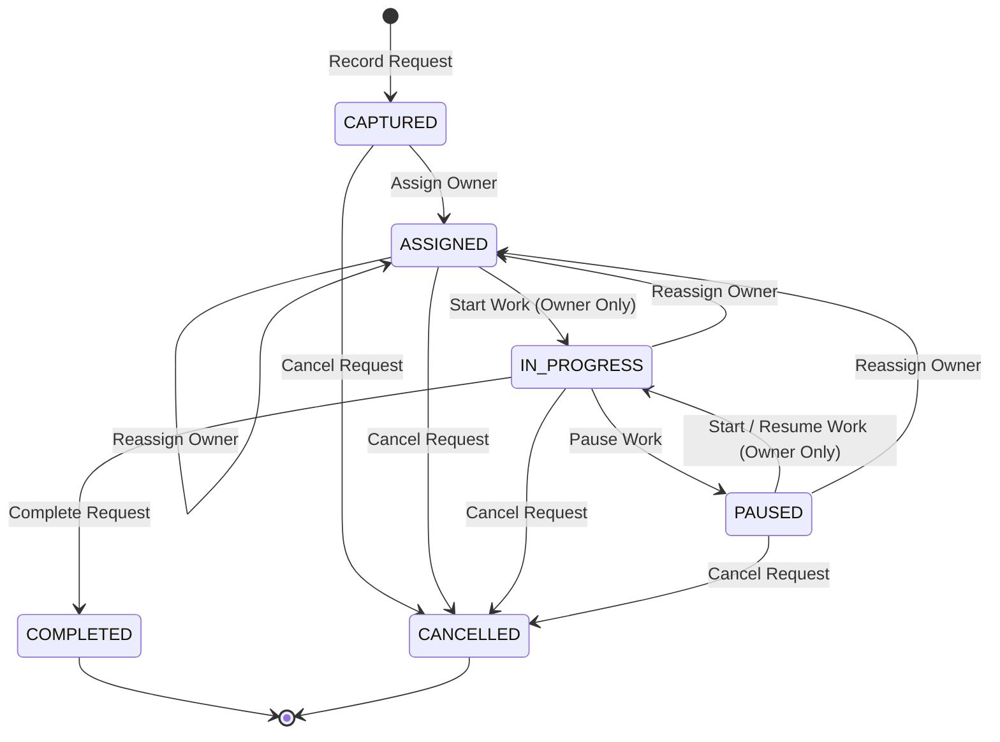

# 1. Overview

This architecture artifact defines the technical realization for simplifying the Request lifecycle in CAKRA, as requested in [CR-016-ISSUE.md](file:///d:/Project.Aktif/b20-agentic-dev/cakra/docs/issues/CR-016-ISSUE.md) and analyzed in [CR-016-FEASIBILITY-ASSESSMENT.md](file:///d:/Project.Aktif/b20-agentic-dev/cakra/docs/analysis/CR-016-FEASIBILITY-ASSESSMENT.md).

The target architecture replaces complex administrative triage and dedicated escalation/decision dockets with a focused, action-oriented lifecycle:



Key architectural transformations include:

1. **State Machine Consolidation**:
   - Reduces authoritative states to 4 active (`CAPTURED`, `ASSIGNED`, `IN_PROGRESS`, `PAUSED`) and 2 terminal (`COMPLETED`, `CANCELLED`).
   - Retires legacy states: `EVALUATING`, `ACCEPTED`, `REJECTED`, and `ESCALATED`.
2. **Direct Action Lifecycle**:
   - `StartWork`: Transitions `ASSIGNED` or `PAUSED` $\rightarrow$ `IN_PROGRESS`; strictly restricted to the assigned owner to enforce personal accountability.
   - `PauseWork`: Transitions `IN_PROGRESS` $\rightarrow$ `PAUSED` with an optional note recorded in audit history; callable by either the assigned owner or management.
   - `Cancel`: Transitions any non-terminal state $\rightarrow$ `CANCELLED` with a mandatory reason; does not block on unfinished subtasks.
   - `AssignOwner`: Transitions `CAPTURED` $\rightarrow$ `ASSIGNED`; reassigning an active request currently in `IN_PROGRESS` or `PAUSED` resets status to `ASSIGNED`.
3. **Retirement of Escalation & Decision Dockets**:
   - Removes dedicated `Escalate`, `RequestManagementDecision`, and `ApplyManagementDecision` services, commands, and controller endpoints.
   - Removes obsolete fields `EscalationReason` and `ManagementDecisionNotes` from domain aggregates.
4. **Embedded Comments & Discussion on Request Detail (`SCR-REQ-003`)**:
   - Embeds a dedicated Comments & Discussion section on [`RequestDetailView.vue`](file:///d:/Project.Aktif/b20-agentic-dev/cakra/src/frontend/Cakra.Web/src/views/RequestDetailView.vue), communicating directly through [`Cakra.Modules.Post`](file:///d:/Project.Aktif/b20-agentic-dev/cakra/src/backend/Cakra.Modules.Post) to resolve blockers and coordinate without separate escalation mechanisms.
5. **Database Migration (`0015_simplify_request_lifecycle.sql`)**:
   - Migrates existing operational rows: `ESCALATED` $\rightarrow$ `PAUSED`, `EVALUATING` & `ACCEPTED` $\rightarrow$ `ASSIGNED`, `REJECTED` $\rightarrow$ `CANCELLED`.
   - Updates table check constraints on `[request].[Requests].[Status]` and `[request].[RequestResolutions].[Outcome]`.
6. **Analytics Alignment (`Cakra.Modules.Analytics`)**:
   - Replaces `EscalatedRequestsCount` / `EscalatedCount` / `IsBlocked` with `PausedRequestsCount` / `PausedCount` / `IsPaused`.
   - Aligns active request filters across all analytics queries and dashboard views.

---

# 2. Architectural Basis

## Business Context

- ISSUE: [CR-016-ISSUE.md](file:///d:/Project.Aktif/b20-agentic-dev/cakra/docs/issues/CR-016-ISSUE.md)
- DOMAIN: [request-domain.md](file:///d:/Project.Aktif/b20-agentic-dev/cakra/docs/domains/request-domain.md) / [CAKRA-DOMAIN.md](file:///d:/Project.Aktif/b20-agentic-dev/cakra/docs/domain/CAKRA-DOMAIN.md) (Request Domain)
- System Architecture: [CAKRA-ARCHITECTURE.md](file:///d:/Project.Aktif/b20-agentic-dev/cakra/docs/architecture/CAKRA-ARCHITECTURE.md)
- UI Layout Spec: Request Detail Screen (`SCR-REQ-003`), Request List (`SCR-REQ-001`), Management Analytics (`SCR-MGT-001`, `SCR-MGT-002`, `SCR-MGT-003`)

## Analysis Input

- FEASIBILITY-ASSESSMENT: [CR-016-FEASIBILITY-ASSESSMENT.md](file:///d:/Project.Aktif/b20-agentic-dev/cakra/docs/analysis/CR-016-FEASIBILITY-ASSESSMENT.md)
  - Approved Decisions: `GAP-001` through `GAP-009`, `OQ-001` through `OQ-007`.
  - Architecture Applicability: `ARCHITECTURE-REQUIRED`.
  - Planning Readiness Gate: `READY-FOR-PLANNING` (granted).

```text
CR-016-ISSUE + CR-016-FEASIBILITY-ASSESSMENT
                     ↓
           CR-016-ARCHITECTURE
```

---

# 3. Scope

## Included

1. **Domain Aggregate & Status Refactor (`Cakra.Modules.Request`)**:
   - Update `RequestStatus` enum to: `Captured = 1`, `Assigned = 2`, `InProgress = 3`, `Paused = 4`, `Completed = 5`, `Cancelled = 6`.
   - Update `RequestStatusNames` helper with string constants and parser logic.
   - Update `Request.cs`:
     - Implement `StartWork(Guid actorPersonId, string? notes, DateTime? utcNow)`.
     - Implement `PauseWork(Guid actorPersonId, string? note, DateTime? utcNow)`.
     - Implement `Cancel(string reason, Guid actorPersonId, DateTime? utcNow)`.
     - Update `AssignOwner`: transition `Captured` $\rightarrow$ `Assigned`, and reset `InProgress` / `Paused` $\rightarrow$ `Assigned`.
     - Remove `Evaluate`, `Accept`, `AcceptResponsibility`, `Reject`, `Escalate`, `ResumeProgress`, `RequestManagementDecision`, and `ApplyManagementDecision`.
     - Remove `EscalationReason` and `ManagementDecisionNotes` properties.
   - Domain Events:
     - Add `RequestWorkStarted.cs`, `RequestWorkPaused.cs`, `RequestCancelled.cs`.
     - Remove `RequestEscalated.cs`, `ManagementDecisionRequested.cs`, `RequestEvaluated.cs`, `RequestAccepted.cs`, `RequestRejected.cs`.
   - Resolution Entity:
     - Update `ResolutionOutcome.cs` and `ResolutionOutcomeNames` to include `Cancelled = 4` (`"CANCELLED"`).
2. **Commands & Services Layer (`Cakra.Modules.Request`)**:
   - Remove `IRequestService.Escalation.cs`, `RequestService.Escalation.cs`, and `RequestEscalationCommands.cs`.
   - Add command records and handlers: `StartWorkCommand`, `PauseWorkCommand`, `CancelRequestCommand`.
   - Remove command records and handlers: `EvaluateRequestCommand`, `AcceptRequestResponsibilityCommand`, `RejectRequestCommand`, `EscalateRequestCommand`, `RequestManagementDecisionCommand`, `ApplyManagementDecisionCommand`.
   - Update `IRequestService` / `RequestService` and `IRequestQueryService` / `RequestQueryService`.
   - Update `RequestRepository` persistence queries and parameter mappings.
3. **API Controller Layer (`Cakra.Api`)**:
   - Expose `POST /api/v1/requests/{id}/start`.
   - Expose `POST /api/v1/requests/{id}/pause`.
   - Expose `POST /api/v1/requests/{id}/cancel`.
   - Remove obsolete endpoints: `/evaluate`, `/accept`, `/reject`, `/escalate`, `/management-decision`, `/management-decision/apply`.
4. **Database Migration Script (`0015_simplify_request_lifecycle.sql`)**:
   - Migrate data in `[request].[Requests]`:
     - `ESCALATED` $\rightarrow$ `PAUSED`
     - `EVALUATING` & `ACCEPTED` $\rightarrow$ `ASSIGNED`
     - `REJECTED` $\rightarrow$ `CANCELLED`
   - Migrate data in `[request].[RequestResolutions]`: `REJECTED` $\rightarrow$ `CANCELLED`.
   - Update check constraints: `CK_Requests_Status` and `CK_RequestResolutions_Outcome`.
5. **Analytics Adaptation (`Cakra.Modules.Analytics`)**:
   - Update `ManagementAnalyticsService.cs` and `ManagementAnalyticsService.RealTime.cs`.
   - Replace `EscalatedCount` / `EscalatedRequestsCount` / `IsBlocked` with `PausedCount` / `PausedRequestsCount` / `IsPaused`.
   - Update active request query predicate: `WHERE r.[Status] IN ('CAPTURED', 'ASSIGNED', 'IN_PROGRESS', 'PAUSED')`.
6. **Frontend User Interface (`Cakra.Web`)**:
   - Update `src/api/requests.ts`: add `startWork`, `pauseWork`, `cancelRequest`; remove legacy endpoints.
   - Update `RequestDetailView.vue` (`SCR-REQ-003`):
     - Action bar: Render contextual buttons based on state:
       - `CAPTURED`: [Assign Owner], [Cancel Request]
       - `ASSIGNED`: [Start Work] (if current user is owner), [Reassign Owner], [Cancel Request]
       - `IN_PROGRESS`: [Pause Work], [Complete Request], [Reassign Owner], [Cancel Request]
       - `PAUSED`: [Start / Resume Work] (if current user is owner), [Reassign Owner], [Cancel Request]
       - `COMPLETED` / `CANCELLED`: Read-only (closed)
     - Embed dedicated Comments & Discussion card querying `GET /api/v1/posts/{postId}/comments` and posting `POST /api/v1/posts/{postId}/comments`.
   - Update list and search views:
     - `RequestListView.vue`, `MyRequestsView.vue`, `RequestSearchView.vue`: Align status filters, badges, and tab groupings (`ALL`, `CAPTURED`, `ASSIGNED`, `IN_PROGRESS`, `PAUSED`, `COMPLETED`, `CANCELLED`).
   - Update analytics views:
     - `CustomerPortfolioView.vue`, `ProgrammerWorkloadView.vue`, `ProgrammerPerformanceView.vue`: Display Paused metrics instead of Escalated.
7. **Automated Testing**:
   - Update Unit Tests in `Cakra.Tests.Unit`:
     - `RequestStateMachineTests.cs`: Test `StartWork`, `PauseWork`, `Cancel`, and reassignment reset.
     - Delete or refactor `RequestEscalationAndManagementTests.cs`.
   - Update Integration Tests in `Cakra.Tests.Integration`:
     - `RequestsControllerTests.cs`: Verify start, pause, cancel, and reassignment endpoints.
     - `AnalyticsRealTimeQueriesIntegrationTests.cs`, `AnalyticsSnapshotIntegrationTests.cs`: Verify paused metrics calculations.

## Excluded

1. Changing the core structure of `RequestSubTask` (subtasks continue to function as defined in CR-006).
2. Changing the complexity rating rules (complexity 1-5 continues to be editable across active states).
3. Modifying Customer, Product, or Work Package domain models.

---

# 4. Technical Decisions

## TD-001: Consolidated 6-State Lifecycle Model

The authoritative lifecycle is defined by `RequestStatus`:

| Enum Value | Name | Numeric | Classification | Meaning |
| :--- | :--- | :--- | :--- | :--- |
| `Captured` | `CAPTURED` | 1 | Active | Newly recorded demand; unassigned. |
| `Assigned` | `ASSIGNED` | 2 | Active | Owner designated; awaiting owner initiation. |
| `InProgress` | `IN_PROGRESS` | 3 | Active | Active work underway by the designated owner. |
| `Paused` | `PAUSED` | 4 | Active | Work temporarily suspended due to priority, blocker, or management direction. |
| `Completed` | `COMPLETED` | 5 | Terminal | Successful conclusion and verified resolution. |
| `Cancelled` | `CANCELLED` | 6 | Terminal | Abandoned, duplicate, or rejected without completion. |

*Rationale*: Intermediate triage states (`Evaluating`, `Accepted`) created administrative burden without operational value. Replacing `Escalated` with `Paused` models work suspension directly while allowing comments to capture blockers.

## TD-002: Direct Action State Transitions & Owner Accountability

- **`StartWork`**:
  - Source states: `ASSIGNED` or `PAUSED`.
  - Target state: `IN_PROGRESS`.
  - Authorization: **Strictly the Assigned Owner** (`ActorPersonId == OwnerPersonId`). If a non-owner attempts to start work, domain throws `InvalidOperationException("Only the assigned owner can start work on this request.")`.
- **`PauseWork`**:
  - Source states: `IN_PROGRESS`.
  - Target state: `PAUSED`.
  - Authorization: Assigned Owner, Manager, Team Lead, or Admin.
  - Payload: Optional `Note` (persisted into `RequestAssignments` audit record).
- **`Complete`**:
  - Source states: `IN_PROGRESS`.
  - Target state: `COMPLETED`.
  - Invariant: All subtasks must be completed (`_subTasks.All(t => t.IsCompleted)`). Throws `RequestHasUnfinishedSubTasksException` if unfinished subtasks remain.
  - Payload: Mandatory `ResolutionDescription`.
- **`Cancel`**:
  - Source states: `CAPTURED`, `ASSIGNED`, `IN_PROGRESS`, `PAUSED`.
  - Target state: `CANCELLED`.
  - Invariant: Permitted regardless of unfinished subtasks (subtasks are not deleted, but do not block cancellation).
  - Payload: Mandatory `CancellationReason` (persisted into `RequestResolution` with `Outcome = 'CANCELLED'`).

## TD-003: Active Work Reassignment Reset

When `AssignOwner` is called:
1. If current status is `CAPTURED`: Transitions to `ASSIGNED`.
2. If current status is `ASSIGNED`: Updates owner, remains in `ASSIGNED`.
3. If current status is `IN_PROGRESS` or `PAUSED`: Updates owner, **resets status to `ASSIGNED`**.
4. If current status is `COMPLETED` or `CANCELLED`: Throws `InvalidRequestStateTransitionException` (closed requests cannot be reassigned).

*Rationale*: Reassigning active work to a new person resets it to `ASSIGNED` so that the new owner explicitly commits to starting work via `StartWork`, preventing false in-progress telemetry.

## TD-004: Retirement of Dedicated Escalation and Management Decision Dockets

- Delete `IRequestService.Escalation.cs`, `RequestService.Escalation.cs`, and `RequestEscalationCommands.cs`.
- Remove `EscalateRequestCommand`, `RequestManagementDecisionCommand`, `ApplyManagementDecisionCommand`.
- Remove `[EscalationReason]` and `[ManagementDecisionNotes]` from domain entity and repository mappings.
- Operational blockers and management assistance are communicated via direct comments on the request.

## TD-005: Embedded Comments & Discussion Integration on `SCR-REQ-003`

- Every operational request is automatically linked to a primary Post in `[post].[Posts]` via `[post].[PostReferences]` (`ReferenceType = 'REQUEST'`, `ReferenceId = RequestId`).
- `RequestDetailView.vue` queries `GET /api/v1/posts/by-reference/REQUEST/{requestId}` (or retrieves the primary post ID) and embeds a comments thread invoking:
  - `GET /api/v1/posts/{postId}/comments` to load chronological discussion.
  - `POST /api/v1/posts/{postId}/comments` to add a comment with content and author.
- Comments support discussion of blockers, technical questions, and management guidance directly on the Request Detail page.

## TD-006: Database Schema Migration (`0015_simplify_request_lifecycle.sql`)

```sql
-- 1. Migrate active operational rows
UPDATE [request].[Requests] SET [Status] = 'PAUSED' WHERE [Status] = 'ESCALATED';
UPDATE [request].[Requests] SET [Status] = 'ASSIGNED' WHERE [Status] IN ('EVALUATING', 'ACCEPTED');
UPDATE [request].[Requests] SET [Status] = 'CANCELLED' WHERE [Status] = 'REJECTED';

-- 2. Migrate resolution outcomes
UPDATE [request].[RequestResolutions] SET [Outcome] = 'CANCELLED' WHERE [Outcome] = 'REJECTED';

-- 3. Update check constraints
ALTER TABLE [request].[Requests] DROP CONSTRAINT [CK_Requests_Status];
ALTER TABLE [request].[Requests] ADD CONSTRAINT [CK_Requests_Status] 
    CHECK ([Status] IN ('CAPTURED', 'ASSIGNED', 'IN_PROGRESS', 'PAUSED', 'COMPLETED', 'CANCELLED'));

ALTER TABLE [request].[RequestResolutions] DROP CONSTRAINT [CK_RequestResolutions_Outcome];
ALTER TABLE [request].[RequestResolutions] ADD CONSTRAINT [CK_RequestResolutions_Outcome] 
    CHECK ([Outcome] IN ('COMPLETED', 'RESOLVED', 'CANCELLED', 'REJECTED'));
```

## TD-007: Management Analytics Migration (`Escalated` $\rightarrow$ `Paused`)

- In `ManagementAnalyticsService.cs` and `ManagementAnalyticsService.RealTime.cs`:
  - Active request predicate updated to: `r.[Status] IN ('CAPTURED', 'ASSIGNED', 'IN_PROGRESS', 'PAUSED')`.
  - `EscalatedCount` / `EscalatedRequestsCount` replaced with `PausedCount` / `PausedRequestsCount`.
  - `IsBlocked` mapped to `string.Equals(Status, "PAUSED", StringComparison.OrdinalIgnoreCase)`.
  - Real-time queries group counts for `PAUSED` instead of `ESCALATED`.

---

# 5. Component Responsibilities

| Component | Responsibility |
| :--- | :--- |
| `Request` (Aggregate Root) | Authoritative state machine transitions (`AssignOwner`, `StartWork`, `PauseWork`, `Complete`, `Cancel`), invariant enforcement, subtask tracking. |
| `RequestStatus` | Defines canonical enum values (`Captured`, `Assigned`, `InProgress`, `Paused`, `Completed`, `Cancelled`) and string mappings. |
| `RequestResolution` | Records terminal closure details (`Completed`, `Resolved`, `Cancelled`) with description and timestamp. |
| `RequestAssignment` | Records chronological audit log of all ownership and status transitions. |
| `RequestService` | Application command handlers for `StartWorkCommand`, `PauseWorkCommand`, `CancelRequestCommand`, `AssignRequestOwnerCommand`, `CompleteRequestCommand`. |
| `RequestQueryService` | Read-only queries for requests by ID, my requests, active subtasks, and state history. |
| `RequestsController` | REST API endpoints exposing `/start`, `/pause`, `/cancel`, `/assign`, `/complete`, `/complexity`. |
| `PostService` & `FeedQueryService` | Manages operational comments linked to requests via `PostReferenceTypes.Request`. |
| `ManagementAnalyticsService` | Computes portfolio, performance, and workload metrics using `PAUSED` for suspended work tracking. |
| `RequestDetailView.vue` (`SCR-REQ-003`) | UI for viewing request properties, state history, action buttons (Start, Pause, Reassign, Complete, Cancel), and embedded Comments & Discussion. |
| `RequestListView.vue` (`SCR-REQ-001`) | Filterable operational list grouped by simplified statuses (`ALL`, `CAPTURED`, `ASSIGNED`, `IN_PROGRESS`, `PAUSED`, `COMPLETED`, `CANCELLED`). |

---

# 6. Integration Design

| Source | Target | Purpose |
| :--- | :--- | :--- |
| `RequestsController` | `IMediator` / `RequestService` | Dispatches lifecycle commands (`StartWork`, `PauseWork`, `CancelRequest`). |
| `RequestService` | `IRequestRepository` | Persists aggregate state changes and audit assignments in a single transaction. |
| `RequestService` | `IDomainEventPublisher` | Dispatches domain events (`RequestWorkStarted`, `RequestWorkPaused`, `RequestCancelled`, `RequestCompleted`). |
| `FeedProjectionHandler` | `[post].[FeedItems]` | Listens to request events and updates feed entries. |
| `RequestDetailView.vue` | `RequestsController` (`/api/v1/requests`) | Executes lifecycle actions and loads request details / state history. |
| `RequestDetailView.vue` | `PostsController` (`/api/v1/posts`) | Queries and appends comments to the request's primary operational post. |
| `ManagementAnalyticsService` | `[request].[Requests]` | Queries active (`CAPTURED`, `ASSIGNED`, `IN_PROGRESS`, `PAUSED`) and paused request metrics. |

---

# 7. Data Ownership

| Data Entity | Owning Component |
| :--- | :--- |
| Request Lifecycle & Attributes (`[request].[Requests]`) | `Cakra.Modules.Request` |
| Request Audit History (`[request].[RequestAssignments]`) | `Cakra.Modules.Request` |
| Request Terminal Resolutions (`[request].[RequestResolutions]`) | `Cakra.Modules.Request` |
| Operational Posts & Comments (`[post].[Posts]`, `[post].[Comments]`) | `Cakra.Modules.Post` |
| Operational Analytics Projections (`[analytics].*`) | `Cakra.Modules.Analytics` |

---

# 8. Database Design

## New Tables

None.

## Modified Tables

| Table | Change |
| :--- | :--- |
| `[request].[Requests]` | 1. Update `[Status]` column values via migration script.<br>2. Replace constraint `CK_Requests_Status` to allow `'CAPTURED', 'ASSIGNED', 'IN_PROGRESS', 'PAUSED', 'COMPLETED', 'CANCELLED'`.<br>3. Deprecate `[EscalationReason]` and `[ManagementDecisionNotes]`. |
| `[request].[RequestResolutions]` | 1. Update `[Outcome]` values (`REJECTED` $\rightarrow$ `CANCELLED`).<br>2. Update constraint `CK_RequestResolutions_Outcome` to allow `'COMPLETED', 'RESOLVED', 'CANCELLED', 'REJECTED'`. |

## Migration Considerations

Migration script `0015_simplify_request_lifecycle.sql` will execute automatically on application startup via DbUp in `Cakra.Api`. It will run idempotently and safely migrate all existing data without data loss.

---

# 9. Cross-Cutting Concerns

1. **Security & Authorization**:
   - `StartWork`: Strictly enforced in domain and application service to match `OwnerPersonId`.
   - `PauseWork`: Authorized for Programmer (Owner), Team Lead, Manager, Administrator.
   - `Cancel`: Authorized for Requester (Creator), Owner, Team Lead, Manager, Administrator.
   - `AssignOwner`: Authorized for Team Lead, Manager, Administrator, and current Owner.
2. **Audit Trail Fidelity**:
   - Every status transition (including Pause, Cancel, Start, Reassign) inserts a record into `[request].[RequestAssignments]` preserving `PreviousStatus`, `NewStatus`, `PreviousOwnerPersonId`, `AssignedOwnerPersonId`, `ActorPersonId`, and `Notes`.
3. **Optimistic Concurrency**:
   - Monotonic UTC timestamp checking on aggregate root updates.
4. **Subtask Consistency**:
   - `Complete`: Hard block if unfinished subtasks exist (`RequestHasUnfinishedSubTasksException`).
   - `Cancel`: Allows closure with unfinished subtasks, recording cancellation justification in `RequestResolutions`.

---

# 10. Implementation Constraints

1. **Dapper Only**: Persistence continues to use Dapper with SQL Server; no ORM or Entity Framework.
2. **Domain-Driven Design**: Invariants must be enforced inside the `Request` aggregate root; controllers and services must not manipulate status directly.
3. **No Breaking Frontend State**: The frontend must gracefully display existing requests and handle both newly migrated statuses and existing subtasks.
4. **Native Vue 3**: Comments UI component in `RequestDetailView.vue` must use native Vue 3 Composition API and Bootstrap 5 styling consistent with Cakra conventions.

---

# 11. Acceptance Conditions

1. `RequestStatus` exposes only `Captured`, `Assigned`, `InProgress`, `Paused`, `Completed`, `Cancelled`.
2. Obsolete methods (`Evaluate`, `Accept`, `Reject`, `Escalate`, `RequestManagementDecision`, `ApplyManagementDecision`) are removed from `Request.cs`.
3. `StartWork` successfully transitions `ASSIGNED` or `PAUSED` $\rightarrow$ `IN_PROGRESS`, rejecting attempts by non-owners.
4. `PauseWork` successfully transitions `IN_PROGRESS` $\rightarrow$ `PAUSED` with an optional note.
5. `Cancel` successfully transitions any non-terminal state $\rightarrow$ `CANCELLED` with a mandatory reason.
6. Reassigning an active request in `IN_PROGRESS` or `PAUSED` resets its status to `ASSIGNED`.
7. `RequestsController` exposes `/start`, `/pause`, and `/cancel` endpoints, while obsolete endpoints are removed.
8. Migration script `0015_simplify_request_lifecycle.sql` successfully updates existing data and constraints.
9. `ManagementAnalyticsService` correctly calculates active requests and tracks `Paused` requests in place of `Escalated`.
10. `RequestDetailView.vue` presents contextual action buttons and includes an embedded Comments & Discussion component.
11. All unit and integration test suites pass.
