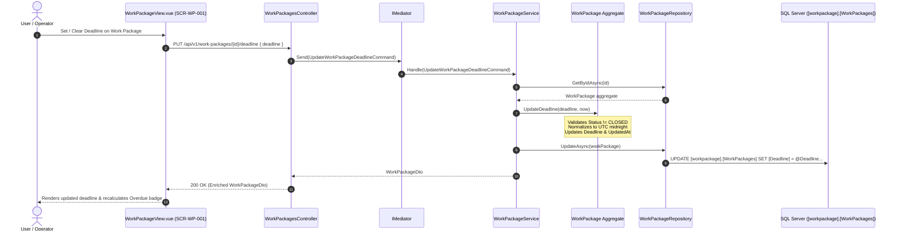

# 1. Overview

This architecture defines the technical realization for Change Request `CR-023`: Implementation of an optional target deadline attribute for the Work Package aggregate root (`WorkPackage.cs`), database schema, application services, REST API endpoints, and screen `SCR-WP-001` (`WorkPackageView.vue`).

It consumes and realizes the approved feasibility decisions from [CR-023-FEASIBILITY-ASSESSMENT.md](file:///d:/Project.Aktif/b20-agentic-dev/cakra/docs/analysis/CR-023-FEASIBILITY-ASSESSMENT.md), establishing:

1. Database schema migration `0017_add_workpackage_deadline.sql` adding column `[Deadline] DATETIME2 NULL` and a filtered index to `[workpackage].[WorkPackages]`.
2. Property `Deadline` (`DateTime?`, UTC midnight) on the `WorkPackage` aggregate root with UTC date-only normalization and active lifecycle gating (`DRAFT` and `ACTIVE` mutable; `CLOSED` strictly immutable).
3. Aggregate mutation method `UpdateDeadline(DateTime? deadline, DateTime? updatedAtUtc = null)` updating `UpdatedAt` without requiring domain events (per alignment).
4. Updates to `WorkPackageRepository` and `WorkPackageQueryService` for Dapper query mapping and entity hydration.
5. MediatR command `CreateWorkPackageCommand` extended with optional `Deadline`, and a new dedicated command `UpdateWorkPackageDeadlineCommand`.
6. Dedicated REST API endpoint `PUT /api/v1/work-packages/{id}/deadline` and request body updates on `POST /api/v1/work-packages`.
7. `WorkPackageDto` extended with `public DateTime? Deadline { get; init; }`.
8. Frontend UI updates in `src/frontend/Cakra.Web`:
   - `workpackages.ts` client API types and methods.
   - `WorkPackageView.vue`:
     - Optional deadline date picker in the "Create Work Package" modal.
     - "Deadline" column in the Work Package table with formatted date presentation.
     - Target deadline display in the Detail Panel with inline edit/clear controls when in `DRAFT` or `ACTIVE`.
     - Dynamic client-side "Overdue" badge calculation when `Deadline < Today` for open packages (`DRAFT` or `ACTIVE`), automatically hidden when `CLOSED`.

---

# 2. Architectural Basis

## Business Context

- ISSUE: [CR-023-ISSUE.md](file:///d:/Project.Aktif/b20-agentic-dev/cakra/docs/issues/CR-023-ISSUE.md)
- SYSTEM ARCHITECTURE: [CAKRA-ARCHITECTURE.md](file:///d:/Project.Aktif/b20-agentic-dev/cakra/docs/architecture/CAKRA-ARCHITECTURE.md)
- UI SPECIFICATION: [Work Package Screen (`SCR-WP-001`)](file:///d:/Project.Aktif/b20-agentic-dev/cakra/src/frontend/Cakra.Web/src/views/WorkPackageView.vue)

## Analysis Input

- FEASIBILITY ASSESSMENT: [CR-023-FEASIBILITY-ASSESSMENT.md](file:///d:/Project.Aktif/b20-agentic-dev/cakra/docs/analysis/CR-023-FEASIBILITY-ASSESSMENT.md) (Status: `READY-FOR-PLANNING`)

This architecture consumes and realizes the approved decisions:
- `GAP-001`: Database migration `0017_add_workpackage_deadline.sql`.
- `GAP-002`: Aggregate property `Deadline`, normalization helper, `Create(...)` parameter, and `UpdateDeadline(...)` mutation method.
- `GAP-003`: Persistence queries, hydration, and read model projections in `WorkPackageRepository` and `WorkPackageQueryService`.
- `GAP-004`: `CreateWorkPackageCommand`, `UpdateWorkPackageDeadlineCommand`, and `WorkPackageDto` extensions.
- `GAP-005`: REST API endpoint `PUT /api/v1/work-packages/{id}/deadline` in `WorkPackagesController`.
- `GAP-006` through `GAP-009`: Frontend create modal, table column, detail panel editing, and overdue badging on `SCR-WP-001`.
- Closed decisions `OQ-001` through `OQ-006`: Native Work Package attribute, date-only UTC midnight granularity, active-state mutability, closed-state locking, dedicated PUT endpoint, and no domain event emission.

---

# 3. Scope

## Included

1. **Database Schema Migration (`Cakra.Api/Migrations/Scripts/0017_add_workpackage_deadline.sql`)**:
   - Idempotent script adding `[Deadline] DATETIME2 NULL` to `[workpackage].[WorkPackages]`.
   - Filtered nonclustered index `[IX_WorkPackages_Deadline]` on `([Deadline]) WHERE [Deadline] IS NOT NULL`.
2. **Domain Aggregate Model (`Cakra.Modules.WorkPackage.Domain.WorkPackage`)**:
   - Public property `DateTime? Deadline { get; private set; }`.
   - Static normalization helper `NormalizeDeadline(DateTime? deadline)` ensuring stored values are UTC date-only (midnight UTC `00:00:00Z`).
   - Extended `Create(...)` factory method accepting optional `DateTime? deadline = null`.
   - Extended `Rehydrate(...)` method accepting `DateTime? deadline = null`.
   - Method `UpdateDeadline(DateTime? deadline, DateTime? updatedAtUtc = null)` throwing `WorkPackageDomainException` if `Status == WorkPackageStatus.Closed`.
3. **Persistence Layer (`Cakra.Modules.WorkPackage.Persistence.WorkPackageRepository`)**:
   - Update `SELECT`, `INSERT INTO [workpackage].[WorkPackages]`, and `UPDATE [workpackage].[WorkPackages]` queries to include `Deadline`.
   - Update `WorkPackageRow` private record to include `Deadline` and pass it to `Rehydrate(...)`.
4. **Query Service Layer (`Cakra.Modules.WorkPackage.Services.WorkPackageQueryService`)**:
   - Update `GetWorkPackageByIdAsync`, `ListWorkPackagesAsync`, and `GetRequestWorkPackageAsync` SQL queries to select `wp.[Deadline]`.
   - Update `WorkPackageQueryRow` private record and `ToDto(...)` mapper to project `Deadline`.
5. **Application Commands & Handlers (`Cakra.Modules.WorkPackage.Services`)**:
   - Update `CreateWorkPackageCommand` with `DateTime? Deadline = null`.
   - Create `UpdateWorkPackageDeadlineCommand(Guid WorkPackageId, DateTime? Deadline)` and validator `UpdateWorkPackageDeadlineCommandValidator`.
   - Update `WorkPackageService.CreateWorkPackageAsync` and add `WorkPackageService.UpdateDeadlineAsync(Guid workPackageId, DateTime? deadline, CancellationToken cancellationToken)`.
   - Implement `IRequestHandler<UpdateWorkPackageDeadlineCommand, WorkPackageDto>` in `WorkPackageService`.
6. **Read Models & API Contracts (`Cakra.Modules.WorkPackage.Models` & `Cakra.Api`)**:
   - Add `public DateTime? Deadline { get; init; }` to `WorkPackageDto`.
   - Update `CreateWorkPackageBody` to accept `public DateTime? Deadline { get; set; }`.
   - Add `UpdateWorkPackageDeadlineBody` with `public DateTime? Deadline { get; set; }`.
   - Add `PUT /api/v1/work-packages/{id}/deadline` in `WorkPackagesController`.
7. **Frontend API Client (`src/frontend/Cakra.Web/src/api/workpackages.ts`)**:
   - Add `deadline?: string | null` to `WorkPackageDto` and `CreateWorkPackagePayload`.
   - Add interface `UpdateWorkPackageDeadlinePayload { deadline: string | null }`.
   - Add exported helper function `updateWorkPackageDeadline(id: string, payload: UpdateWorkPackageDeadlinePayload): Promise<WorkPackageDto>`.
8. **Frontend Screen & Components (`src/frontend/Cakra.Web/src/views/WorkPackageView.vue`)**:
   - Add `deadline?: string | null` to `WorkPackageItem`.
   - In "Create Work Package" modal: add date input for target deadline.
   - In Work Packages table: add "Deadline" column rendering formatted date and red "Overdue" badge if `Deadline < Today` while open (`DRAFT` or `ACTIVE`).
   - In Detail Panel metadata: display target deadline with formatted date and badge.
   - In Detail Panel actions: add a dedicated deadline editing / clearing form or control available when `canModifyPackage` is true.

## Excluded

- Adding deadline to `WorkPackageRequest` scope items (individual requests already have their own `Deadline` attribute via CR-020).
- Emitting a domain event for deadline updates (per agreed interview decision).
- Modifying other bounded contexts (`Organization`, `Customer`, `Product`, `Request`, `Post`).
- Enforcing past-date validation upon entry (target dates are informational).

---

# 4. Technical Decisions

## TD-001: Database Schema & Migration `0017_add_workpackage_deadline.sql`

A new DbUp migration script `0017_add_workpackage_deadline.sql` will be added:

```sql
IF OBJECT_ID(N'[workpackage].[WorkPackages]', N'U') IS NOT NULL
BEGIN
    IF COL_LENGTH(N'[workpackage].[WorkPackages]', N'Deadline') IS NULL
    BEGIN
        ALTER TABLE [workpackage].[WorkPackages]
            ADD [Deadline] DATETIME2 NULL;
    END;

    IF NOT EXISTS (
        SELECT 1 FROM sys.indexes 
        WHERE name = N'IX_WorkPackages_Deadline' 
          AND object_id = OBJECT_ID(N'[workpackage].[WorkPackages]')
    )
    BEGIN
        EXEC(N'CREATE NONCLUSTERED INDEX [IX_WorkPackages_Deadline] 
            ON [workpackage].[WorkPackages] ([Deadline])
            WHERE [Deadline] IS NOT NULL;');
    END;
END;
```

This migration is idempotent, non-blocking, and preserves all existing rows with default `NULL`.

## TD-002: Domain Model & Date Normalization

In `WorkPackage.cs`:

```csharp
public DateTime? Deadline { get; private set; }

private static DateTime? NormalizeDeadline(DateTime? deadline)
{
    if (!deadline.HasValue) return null;
    var d = deadline.Value;
    return new DateTime(d.Year, d.Month, d.Day, 0, 0, 0, DateTimeKind.Utc);
}

public static WorkPackage Create(
    string name,
    string objective,
    Guid ownerPersonId,
    Guid? customerId = null,
    Guid? productId = null,
    Guid? id = null,
    DateTime? createdAtUtc = null,
    DateTime? deadline = null)
{
    // ... validation ...
    var workPackage = new WorkPackage
    {
        Id = packageId,
        Name = name.Trim(),
        Objective = objective.Trim(),
        OwnerPersonId = ownerPersonId,
        CustomerId = customerId,
        ProductId = productId,
        Deadline = NormalizeDeadline(deadline),
        Status = WorkPackageStatus.Draft,
        CreatedAt = timestamp,
        UpdatedAt = null
    };
    // ...
    return workPackage;
}

public void UpdateDeadline(DateTime? deadline, DateTime? updatedAtUtc = null)
{
    if (Status == WorkPackageStatus.Closed)
    {
        throw new WorkPackageDomainException(
            $"Cannot update deadline for closed Work Package '{Id}'.");
    }

    var normalizedNewDeadline = NormalizeDeadline(deadline);
    if (normalizedNewDeadline == Deadline)
    {
        return;
    }

    Deadline = normalizedNewDeadline;
    UpdatedAt = updatedAtUtc ?? DateTime.UtcNow;
}
```

## TD-003: Persistence & Query Projections

1. **`WorkPackageRepository.cs`**:
   - `packageSql` / `packagesSql` queries: add `[Deadline]`.
   - `AddAsync`: add `[Deadline]` to `INSERT INTO [workpackage].[WorkPackages] (...) VALUES (..., @Deadline, ...)`.
   - `UpdateAsync`: add `[Deadline] = @Deadline` to `UPDATE [workpackage].[WorkPackages] SET ...`.
   - `WorkPackageRow`: add `public DateTime? Deadline { get; init; }`, and pass `Deadline` into `Domain.WorkPackage.Rehydrate(...)`.

2. **`WorkPackageQueryService.cs`**:
   - `GetWorkPackageByIdAsync`, `ListWorkPackagesAsync`, `GetRequestWorkPackageAsync` SQL: add `wp.[Deadline]`.
   - `WorkPackageQueryRow`: add `public DateTime? Deadline { get; init; }`.
   - `ToDto(...)`: map `Deadline = Deadline`.

## TD-004: REST API & DTO Contracts

1. **`WorkPackageDto`**:
   Add property:
   ```csharp
   public DateTime? Deadline { get; init; }
   ```
2. **Commands (`WorkPackageCommands.cs`)**:
   ```csharp
   public sealed record CreateWorkPackageCommand(
       string Name,
       string Objective,
       Guid OwnerPersonId,
       Guid? CustomerId = null,
       Guid? ProductId = null,
       DateTime? Deadline = null) : IRequest<WorkPackageDto>;

   public sealed record UpdateWorkPackageDeadlineCommand(
       Guid WorkPackageId,
       DateTime? Deadline) : IRequest<WorkPackageDto>;

   public sealed class UpdateWorkPackageDeadlineCommandValidator : AbstractValidator<UpdateWorkPackageDeadlineCommand>
   {
       public UpdateWorkPackageDeadlineCommandValidator()
       {
           RuleFor(x => x.WorkPackageId)
               .NotEmpty().WithMessage("Work package ID is required.");
       }
   }
   ```
3. **Controller (`WorkPackagesController.cs`)**:
   ```csharp
   [HttpPut("{id:guid}/deadline")]
   [ProducesResponseType(typeof(WorkPackageDto), StatusCodes.Status200OK)]
   [ProducesResponseType(typeof(ProblemDetails), StatusCodes.Status400BadRequest)]
   [ProducesResponseType(typeof(ProblemDetails), StatusCodes.Status404NotFound)]
   [ProducesResponseType(typeof(ProblemDetails), StatusCodes.Status401Unauthorized)]
   public async Task<IActionResult> UpdateDeadline(
       Guid id,
       [FromBody(EmptyBodyBehavior = EmptyBodyBehavior.Allow)] UpdateWorkPackageDeadlineBody? request = null,
       CancellationToken cancellationToken = default)
   {
       var command = new UpdateWorkPackageDeadlineCommand(
           WorkPackageId: id,
           Deadline: request?.Deadline);

       try
       {
           var updated = await _mediator.Send(command, cancellationToken);
           var enriched = await _workPackageQueryService.GetWorkPackageByIdAsync(updated.Id, cancellationToken) ?? updated;
           return Ok(enriched);
       }
       catch (Exception ex) when (ex is InvalidOperationException or WorkPackageDomainException)
       {
           return CreateBadRequestProblem(ex.Message);
       }
   }
   ```

## TD-005: Frontend Date Handling & Overdue Presentation on SCR-WP-001

1. **Date Format & Transmission**:
   - Dates in the HTML `<input type="date">` are bound as `YYYY-MM-DD` strings.
   - On save, empty strings are sent as `null`.
2. **Overdue Computation (`WorkPackageView.vue`)**:
   ```typescript
   function isWorkPackageOverdue(wp: WorkPackageItem | null | undefined): boolean {
     if (!wp?.deadline) return false
     if (wp.status === 'CLOSED') return false
     const deadlineDate = new Date(wp.deadline)
     const today = new Date()
     today.setHours(0, 0, 0, 0)
     deadlineDate.setHours(0, 0, 0, 0)
     return deadlineDate < today
   }
   ```
3. **Table Column Presentation (`SCR-WP-001`)**:
   Add table header `<th scope="col" style="width: 130px">Deadline</th>` before `Status`.
   Render:
   ```html
   <td>
     <div v-if="wp.deadline" class="d-flex align-items-center gap-1">
       <span class="small font-monospace" style="font-size: 11.5px">{{ formatDeadline(wp.deadline) }}</span>
       <span v-if="isWorkPackageOverdue(wp)" class="badge text-bg-danger" style="font-size: 9.5px" data-testid="wp-overdue-badge">
         Overdue
       </span>
     </div>
     <span v-else class="text-body-secondary small" style="font-size: 11px">—</span>
   </td>
   ```
4. **Detail Panel Presentation & Edit Section**:
   - Display target deadline in the metadata grid with formatted date and red overdue badge when applicable.
   - In the detail panel, provide an inline edit form for Deadline (input type date + Save / Clear buttons), active only when `canModifyPackage` is true.

---

# 5. Component Responsibilities

| Component | Responsibility |
|---|---|
| `0017_add_workpackage_deadline.sql` | Adds nullable column `Deadline` and nonclustered filtered index to `[workpackage].[WorkPackages]`. |
| `WorkPackage.cs` | Aggregate root owning `Deadline`, UTC normalization, lifecycle gating, and `UpdateDeadline(...)`. |
| `WorkPackageRepository.cs` | Dapper persistence mapping for `[Deadline]` in queries and entity hydration. |
| `WorkPackageQueryService.cs` | Dapper query mapping projecting `[Deadline]` to `WorkPackageDto`. |
| `WorkPackageCommands.cs` | Defines `CreateWorkPackageCommand` with `Deadline` and `UpdateWorkPackageDeadlineCommand`. |
| `WorkPackageService.cs` | Handles commands, coordinates repository calls, and updates `UpdatedAt`. |
| `WorkPackagesController.cs` | Exposes REST endpoint `PUT /api/v1/work-packages/{id}/deadline` and updates creation payload. |
| `WorkPackageDto.cs` | DTO exposing `Deadline` to client consumers. |
| `api/workpackages.ts` | Frontend HTTP client typing and helper functions for deadline updates. |
| `WorkPackageView.vue` (`SCR-WP-001`) | Renders deadline in modal, table, detail panel, inline edit form, and overdue badging. |

---

# 6. Integration Design



---

# 7. Data Ownership

| Data Element | Owner | Storage Location |
|---|---|---|
| `WorkPackage.Deadline` | `Cakra.Modules.WorkPackage` | Column `[workpackage].[WorkPackages].[Deadline]` (`DATETIME2 NULL`) |

---

# 8. Database Design

## Modified Tables

| Table | Change |
|---|---|
| `[workpackage].[WorkPackages]` | Add column `[Deadline] DATETIME2 NULL`, add filtered nonclustered index `[IX_WorkPackages_Deadline]`. |

## Relationships

No foreign keys are modified. `Deadline` is an intrinsic attribute of the Work Package container.

## Migration Considerations

- Migration script `0017_add_workpackage_deadline.sql` is strictly idempotent using `OBJECT_ID`, `COL_LENGTH`, and `sys.indexes` checks.
- Column is nullable (`NULL`), allowing all existing historical work packages to remain intact without backfill requirements.

---

# 9. Cross-Cutting Concerns

1. **Timezone Normalization**:
   All deadline dates are stored normalized to midnight UTC (`00:00:00Z`). Frontend date pickers interact via ISO date part (`YYYY-MM-DD`).
2. **Lifecycle Invariant Protection**:
   `WorkPackage.UpdateDeadline(...)` enforces that once closed (`CLOSED`), the target deadline cannot be mutated.
3. **Modularity**:
   No cross-schema or direct foreign key references are added.

---

# 10. Implementation Constraints

- Must use Dapper with explicit column mapping in `WorkPackageRepository.cs` and `WorkPackageQueryService.cs`.
- Must adhere to DbUp SQL migration conventions.
- Must preserve existing unit tests and integration tests in `Cakra.Modules.WorkPackage`, `Cakra.Api`, and `Cakra.Tests.*`.
- Frontend controls must gracefully allow clearing the deadline back to `null`.

---

# 11. Acceptance Conditions

1. Database migration `0017_add_workpackage_deadline.sql` executes cleanly and idempotently, creating column `[Deadline] DATETIME2 NULL` and index `[IX_WorkPackages_Deadline]`.
2. `WorkPackage.Create(...)` successfully accepts and stores an optional target deadline normalized to UTC midnight.
3. `WorkPackage.UpdateDeadline(...)` successfully updates or clears (`null`) the deadline when in `DRAFT` or `ACTIVE`, and throws `WorkPackageDomainException` when `CLOSED`.
4. `POST /api/v1/work-packages` accepts `deadline` in the request body.
5. `PUT /api/v1/work-packages/{id}/deadline` updates or clears the target deadline and returns the updated `WorkPackageDto`.
6. Queries (`GetWorkPackageById`, `ListWorkPackages`, `GetRequestWorkPackage`) return the `Deadline` attribute in `WorkPackageDto`.
7. "Create Work Package" modal on `SCR-WP-001` allows selecting a target deadline date.
8. Work Packages table on `SCR-WP-001` renders a "Deadline" column with formatted dates and displays a red "Overdue" badge when `Deadline < Today` for open packages.
9. Detail Panel on `SCR-WP-001` renders the deadline and allows editing or clearing it when the package is active.
10. All backend unit, integration, and frontend tests pass.
