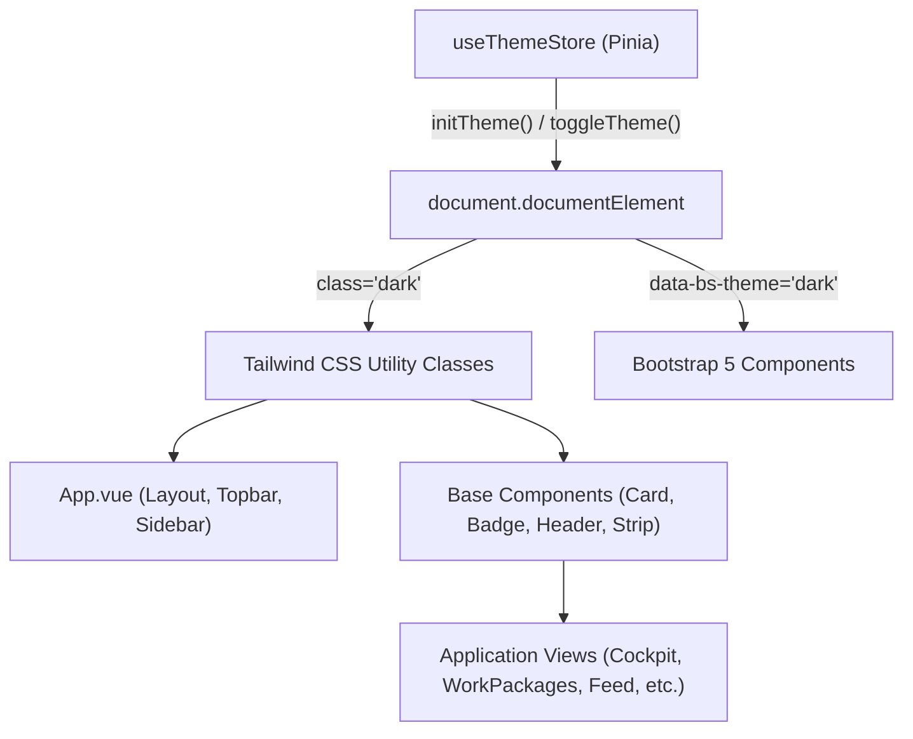

# 1. Overview

This architecture defines the technical realization for Change Request `CR-026`: Executive Dark Theme, Modern Typography (Inter & JetBrains Mono), and Clean Color System for Cakra.Web, porting the executive styling system from the reference infographic (`EXECUTIVE-INFOGRAPHIC-BOD-REV-6.html`).

It consumes and realizes the approved feasibility decisions from [CR-026-FEASIBILITY-ASSESSMENT.md](file:///d:/Project.Aktif/b20-agentic-dev/cakra/docs/analysis/CR-026-FEASIBILITY-ASSESSMENT.md), establishing:

1. **Tailwind CSS Integration**: Adds Tailwind CSS and PostCSS into the Vite build pipeline, enabling direct utility class usage while establishing a safe co-existence and gradual deprecation path for Bootstrap 5.
2. **Executive Design Token System**: Establishes the deep dark theme palette (`slate-950` canvas `#020617`, `slate-900` surfaces `#0f172a`, `slate-800` borders `#1e293b`, saturated cyan `#22d3ee`, indigo `#818cf8`, and emerald `#34d399` accents) mapped cleanly across Tailwind utilities and CSS custom properties.
3. **Typography Modernization**: Imports Google Fonts **Inter** (UI sans-serif with optical sizing and tight tracking) and **JetBrains Mono** (numbers, telemetry, codes, and badges), with robust system font fallbacks.
4. **Theme State Store & Dual DOM Synchronization**: Implements a Pinia `theme` store managing persistent theme selection in `localStorage` (`'dark'` by default), dynamically applying both `class="dark"` and `data-bs-theme="dark"` on `<html>` to guarantee visual harmony across both Tailwind and Bootstrap components.
5. **App Shell Modernization**: Restructures [App.vue](file:///d:/Project.Aktif/b20-agentic-dev/cakra/src/frontend/Cakra.Web/src/App.vue), equipping the Topbar with a theme toggle button and restyling the Sidebar with deep slate gradients and cyan active highlights.
6. **Base UI Components Overhaul**: Refactors reusable primitives in `src/components/base/` ([BaseCard.vue](file:///d:/Project.Aktif/b20-agentic-dev/cakra/src/frontend/Cakra.Web/src/components/base/BaseCard.vue), [BaseBadge.vue](file:///d:/Project.Aktif/b20-agentic-dev/cakra/src/frontend/Cakra.Web/src/components/base/BaseBadge.vue), [PageHeader.vue](file:///d:/Project.Aktif/b20-agentic-dev/cakra/src/frontend/Cakra.Web/src/components/base/PageHeader.vue), [StatusStrip.vue](file:///d:/Project.Aktif/b20-agentic-dev/cakra/src/frontend/Cakra.Web/src/components/base/StatusStrip.vue)) to natively support dark theme elevation, borders, and typography.
7. **View Templates Alignment**: Aligns dashboard views (Cockpit, Work Packages, Feed, Analytics, Requests) with the executive infographic aesthetic.

---

# 2. Architectural Basis

## Business Context

- ISSUE: [CR-026-ISSUE.md](file:///d:/Project.Aktif/b20-agentic-dev/cakra/docs/issues/CR-026-ISSUE.md)
- REFERENCE SPECIFICATION: [cakra-dark-theme-specification.md](file:///C:/Users/drury/.gemini/antigravity/brain/f92d85dd-8ef2-4c63-8b67-ae44de1f604b/cakra-dark-theme-specification.md)
- STYLE SOURCE: [EXECUTIVE-INFOGRAPHIC-BOD-REV-6.html](file:///D:/Project.Aktif/b21-myhosweb-system/EXECUTIVE-INFOGRAPHIC-BOD-REV-6.html)

## Analysis Input

- FEASIBILITY ASSESSMENT: [CR-026-FEASIBILITY-ASSESSMENT.md](file:///d:/Project.Aktif/b20-agentic-dev/cakra/docs/analysis/CR-026-FEASIBILITY-ASSESSMENT.md) (Status: `READY-FOR-PLANNING`)

This architecture consumes and realizes the approved decisions:
- `GAP-001 & OQ-002`: Tailwind CSS integration into Vite with gradual phase-out of Bootstrap 5.
- `GAP-002 & OQ-001`: Executive Dark Theme as default, with Pinia theme store and persistent Topbar toggle.
- `GAP-003 & OQ-003`: Typography modernized to Google Fonts Inter and JetBrains Mono.
- `GAP-004 & OQ-004`: Theme toggle placed in the Topbar right-hand header.
- `GAP-005, GAP-006 & OQ-005`: All-in-one overhaul across App Shell, Base Components, and views.

---

# 3. Scope

## Included

1. **Build Toolchain & Dependencies**:
   - Install `tailwindcss`, `postcss`, `autoprefixer` (or `@tailwindcss/vite`) in `Cakra.Web/package.json`.
   - Configure `tailwind.config.ts` and `postcss.config.js`.
   - Enable `darkMode: 'class'` in Tailwind configuration.
2. **Typography & Styling Pipeline**:
   - Google Fonts webfont imports for `Inter` (weights 300, 400, 500, 600, 700, 800, 900) and `JetBrains Mono` (weights 400, 500, 600, 700) in `main.css`.
   - Executive color token definitions in `tailwind.config.ts` and CSS custom variables in `main.css`.
3. **State Management**:
   - Pinia theme store `src/stores/theme.ts`: reactive state, local storage persistence, DOM attribute synchronization.
4. **Presentation Layer & Shell**:
   - `App.vue`: Topbar theme toggle button, deep dark canvas backdrop, executive sidebar gradient.
   - Base Components in `src/components/base/`: `BaseCard.vue`, `BaseBadge.vue`, `PageHeader.vue`, `StatusStrip.vue`.
   - Views: `OperationsCockpitView.vue`, `WorkPackageView.vue`, `FeedView.vue`, `CustomerPortfolioView.vue`, `ProgrammerWorkloadView.vue`, `RequestDetailView.vue`.

## Excluded

- Backend services (`Cakra.Api`) and database tables (zero server-side or schema changes).
- Changing business logic, API endpoint contracts, or domain invariants.

---

# 4. Technical Decisions

## TD-001: Tailwind CSS Integration in Vite Toolchain

To allow developers to copy and use utility classes directly from `EXECUTIVE-INFOGRAPHIC-BOD-REV-6.html` without translating each into custom CSS rules:
- `tailwindcss`, `postcss`, and `autoprefixer` are added to `devDependencies`.
- `tailwind.config.ts` is configured with:
  ```typescript
  import type { Config } from 'tailwindcss'

  export default {
    darkMode: 'class',
    content: [
      './index.html',
      './src/**/*.{vue,js,ts,jsx,tsx}',
    ],
    theme: {
      extend: {
        colors: {
          slate: {
            850: '#151f32',
            950: '#020617',
          },
        },
        fontFamily: {
          sans: ['Inter', 'system-ui', '-apple-system', 'sans-serif'],
          mono: ['"JetBrains Mono"', 'ui-monospace', 'monospace'],
        },
      },
    },
    plugins: [],
  } satisfies Config
  ```
- `src/assets/main.css` imports `@tailwind base; @tailwind components; @tailwind utilities;` at the top.

## TD-002: Dual-Theme DOM Synchronization Strategy

To ensure seamless coexistence between new Tailwind utility classes and existing Bootstrap components:
- When dark mode is active:
  ```javascript
  document.documentElement.classList.add('dark')
  document.documentElement.setAttribute('data-bs-theme', 'dark')
  ```
- When light mode is active:
  ```javascript
  document.documentElement.classList.remove('dark')
  document.documentElement.setAttribute('data-bs-theme', 'light')
  ```
- This guarantees that Bootstrap dropdowns, tooltips, modals, and form elements automatically switch color schemes alongside Tailwind components.

## TD-003: Executive Design Token Mapping

The core colors from the BOD infographic are formalized into the system:

| Role / Semantic | Light Mode Value | Dark Mode Value (Infographic) | Tailwind Equivalent |
| :--- | :--- | :--- | :--- |
| **Canvas Background** | `#f8fafc` (`slate-50`) | `#020617` (`slate-950`) | `bg-slate-50 dark:bg-slate-950` |
| **Surface Card** | `#ffffff` | `#0f172a` (`slate-900`) | `bg-white dark:bg-slate-900/90` |
| **Elevated Surface** | `#f1f5f9` (`slate-100`)| `#090d16` (`slate-950/60`)| `bg-slate-100 dark:bg-slate-950/60` |
| **Border Subtle** | `#e2e8f0` (`slate-200`)| `#1e293b` (`slate-800`) | `border-slate-200 dark:border-slate-800` |
| **Border Active/Hover**| `#cbd5e1` (`slate-300`)| `#334155` (`slate-700`) | `border-slate-300 dark:border-slate-700` |
| **Primary Text** | `#0f172a` (`slate-900`)| `#ffffff` (Pure White) | `text-slate-900 dark:text-white` |
| **Secondary Text** | `#334155` (`slate-700`)| `#f1f5f9` (`slate-100`) | `text-slate-700 dark:text-slate-100` |
| **Muted Text** | `#64748b` (`slate-500`)| `#94a3b8` (`slate-400`) | `text-slate-500 dark:text-slate-400` |
| **Cyan Accent** | `#0891b2` (`cyan-600`) | `#22d3ee` (`cyan-400`) | `text-cyan-600 dark:text-cyan-400` |
| **Indigo Accent** | `#4f46e5` (`indigo-600`)| `#818cf8` (`indigo-400`) | `text-indigo-600 dark:text-indigo-400` |
| **Emerald Accent** | `#059669` (`emerald-600`)| `#34d399` (`emerald-400`) | `text-emerald-600 dark:text-emerald-400` |

## TD-004: Typography Strategy

- Font imports are placed in `main.css`:
  ```css
  @import url('https://fonts.googleapis.com/css2?family=Inter:wght@300;400;500;600;700;800;900&family=JetBrains+Mono:wght@400;500;600;700&display=swap');
  ```
- Global root typography:
  ```css
  html, body {
    font-family: 'Inter', -apple-system, BlinkMacSystemFont, "Segoe UI", Roboto, sans-serif;
    letter-spacing: -0.011em;
  }
  code, kbd, samp, pre, .font-mono, [data-telemetry] {
    font-family: 'JetBrains Mono', ui-monospace, SFMono-Regular, monospace;
  }
  ```
- Micro-typography rules:
  - Eyebrow labels: `text-xs font-semibold tracking-wider uppercase`.
  - KPI values: `text-3xl font-black tracking-tight`.
  - Section headers: `text-xl font-bold tracking-tight text-white flex items-center gap-2`.

## TD-005: Pinia Theme Store (`src/stores/theme.ts`)

```typescript
import { defineStore } from 'pinia'
import { ref } from 'vue'

export const useThemeStore = defineStore('theme', () => {
  const isDark = ref<boolean>(true)

  function initTheme(): void {
    const stored = localStorage.getItem('cakra_theme')
    if (stored !== null) {
      isDark.value = stored === 'dark'
    } else {
      isDark.value = true // Executive Infographic default
    }
    applyTheme()
  }

  function toggleTheme(): void {
    isDark.value = !isDark.value
    localStorage.setItem('cakra_theme', isDark.value ? 'dark' : 'light')
    applyTheme()
  }

  function applyTheme(): void {
    const root = document.documentElement
    if (isDark.value) {
      root.classList.add('dark')
      root.setAttribute('data-bs-theme', 'dark')
    } else {
      root.classList.remove('dark')
      root.setAttribute('data-bs-theme', 'light')
    }
  }

  return { isDark, initTheme, toggleTheme }
})
```

## TD-006: Topbar Theme Switcher UI & Layout Structure

In `App.vue`:
- The Topbar right-hand section includes a dedicated theme toggle button:
  ```html
  <button
    @click="themeStore.toggleTheme()"
    class="p-1.5 rounded-lg text-slate-400 hover:text-white hover:bg-slate-800 transition"
    :title="themeStore.isDark ? 'Switch to Light Mode' : 'Switch to Dark Mode'"
    aria-label="Toggle theme"
  >
    <i v-if="themeStore.isDark" class="bi bi-sun-fill text-amber-400"></i>
    <i v-else class="bi bi-moon-stars-fill text-indigo-400"></i>
  </button>
  ```
- Sidebar is styled with: `background: linear-gradient(180deg, #020617 0%, #0f172a 50%, #1e1b4b 100%)`, `border-r border-slate-800`.

## TD-007: Base Components Contract

- `BaseCard.vue`:
  - Supports variant `bordered` (default: `bg-slate-900/90 border border-slate-800 rounded-xl shadow-lg`).
  - Supports variant `flat` (`bg-slate-950/60 border border-slate-800/80 rounded-xl`).
  - Supports variant `elevated` (`bg-slate-900 border border-slate-700/80 shadow-2xl rounded-2xl`).
  - Supports `hoverEffect` with subtle border illumination (`hover:border-slate-700 hover:shadow-cyan-500/5`).
- `BaseBadge.vue`:
  - Executive pill styles with 10% opacity fills and 20% opacity borders:
    - `cyan`: `bg-cyan-500/10 text-cyan-400 border border-cyan-500/20`
    - `indigo`: `bg-indigo-500/10 text-indigo-400 border border-indigo-500/20`
    - `emerald`: `bg-emerald-500/10 text-emerald-400 border border-emerald-500/20`
    - `purple`: `bg-purple-500/10 text-purple-400 border border-purple-500/20`
    - `amber`: `bg-amber-500/10 text-amber-400 border border-amber-500/20`
    - `rose`: `bg-rose-500/10 text-rose-400 border border-rose-500/20`
- `StatusStrip.vue`:
  - Renders KPI metric cards with `text-3xl font-black text-white`, uppercase labels (`text-xs uppercase tracking-wider text-slate-400`), and dark gauge tracks (`bg-slate-800 h-1.5 rounded-full overflow-hidden`).

---

# 5. Component Responsibilities

| Component / File | Responsibility |
| :--- | :--- |
| `package.json` & `vite.config.ts` | Includes Tailwind CSS, PostCSS, and Autoprefixer dependencies and build pipeline. |
| `tailwind.config.ts` | Configures dark mode class, font families, and slate/cyan/indigo color tokens. |
| `src/assets/main.css` | Imports Google Fonts, Tailwind directives, theme variables, and global typography. |
| `src/stores/theme.ts` | Manages reactive theme state, `localStorage` persistence, and HTML class toggling. |
| `src/App.vue` | App shell layout, topbar theme toggle, navigation sidebar styling, and container styling. |
| `src/components/base/BaseCard.vue` | Reusable card container styled for dark slate surfaces and glassmorphic borders. |
| `src/components/base/BaseBadge.vue` | Reusable executive status pill badge with translucent tints and borders. |
| `src/components/base/PageHeader.vue`| Standardized page title header with high-contrast text and cyan dot indicator. |
| `src/components/base/StatusStrip.vue`| High-density macro KPI card ribbon with micro-progress gauges. |
| `src/views/*` | Application screens styled with executive dark backgrounds, tables, and modal dialogs. |

---

# 6. Integration Design



---

# 7. Data Ownership

| State Data | Owner | Storage Location |
| :--- | :--- | :--- |
| Active Theme (`dark` vs. `light`) | `useThemeStore` | `localStorage['cakra_theme']` (browser client-side only) |
| System / Backend Entities | Backend Services | PostgreSQL / SQL Server (unchanged) |

---

# 8. Database Design

- **New Tables**: None.
- **Modified Tables**: None.
- **Migration Considerations**: None. This is a 100% frontend visual architecture update.

---

# 9. Cross-Cutting Concerns

1. **Flash of Unstyled Theme (FOUT / FOIT)**:
   - In `index.html`, an inline script checks `localStorage.getItem('cakra_theme') !== 'light'` and pre-applies `class="dark"` and `data-bs-theme="dark"` immediately before Vue mounts. This completely eliminates white flashes during page loads.
2. **Contrast & WCAG 2.1 AA Compliance**:
   - Primary text (`#ffffff` or `#f1f5f9` on `#020617` and `#0f172a`) achieves a contrast ratio > 15:1 (well above the 4.5:1 requirement).
   - Accents (`#22d3ee` cyan, `#34d399` emerald, `#818cf8` indigo) on dark slate achieve contrast ratios > 7:1.
3. **Build & Bundle Performance**:
   - Tailwind CSS purges unused utility classes during `vite build`, adding negligible bundle overhead.

---

# 10. Implementation Constraints

1. **Build Verification Rule**: `vue-tsc --noEmit && vite build` must pass cleanly without TypeScript or CSS compilation errors.
2. **Zero Functional Regression**: Existing forms, routing, data tables, modals, and store interactions must remain fully operational.
3. **No Hardcoded Hex in Components**: Views must use Tailwind utility classes (`bg-slate-900`, `text-slate-100`, `border-slate-800`, `text-cyan-400`) rather than arbitrary inline styles.

---

# 11. Acceptance Conditions

1. **Visual Fidelity**: The application canvas, cards, typography, and badges visually mirror the BOD Infographic (`EXECUTIVE-INFOGRAPHIC-BOD-REV-6.html`).
2. **Default Dark Appearance**: On first load (with no prior `localStorage` entry), Cakra.Web renders in the Executive Dark Theme.
3. **Theme Switcher**: Clicking the Sun/Moon icon in the Topbar toggles smoothly between Dark and Light mode, persisting across page reloads.
4. **Typography**: Headings and body render with Google Font `Inter`; metrics, badges, and codes render with `JetBrains Mono`.
5. **Clean Build**: `npm run build` succeeds with zero errors.
