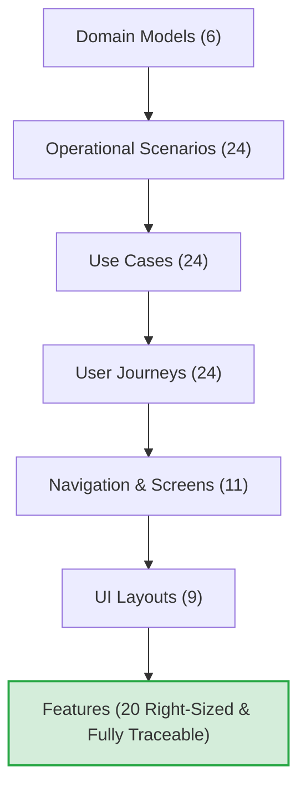

# Feature Re-Review & Validation Report

**Subject:** Operational Feature Artifacts in [`operational/features/`](file:///d:/Project.Aktif/b20-agentic-dev/operational/features)  
**Evaluation Standard:** [`operational/features/feature-review-skill.md`](file:///d:/Project.Aktif/b20-agentic-dev/operational/features/feature-review-skill.md)  
**Audit Date:** 2026-09-27  
**Review Cycle:** Re-Review Post-Remediation (Commit `a507b7f`)  
**Final Verdict:** ✅ **APPROVED (READY FOR IMPLEMENTATION PLANNING)**

---

## 1. Executive Summary

Following the remediation committed in `a507b7f`, a full re-review was conducted against the upstream operational baseline:
- [`operational/domains/`](file:///d:/Project.Aktif/b20-agentic-dev/operational/domains) (6 domains)
- [`operational/scenarios/`](file:///d:/Project.Aktif/b20-agentic-dev/operational/scenarios) (24 scenarios)
- [`operational/use-cases/`](file:///d:/Project.Aktif/b20-agentic-dev/operational/use-cases) (24 use cases)
- [`operational/user-journey/`](file:///d:/Project.Aktif/b20-agentic-dev/operational/user-journey) (24 user journeys)
- [`operational/navigation/`](file:///d:/Project.Aktif/b20-agentic-dev/operational/navigation) (11 screens)
- [`operational/ui-layout/`](file:///d:/Project.Aktif/b20-agentic-dev/operational/ui-layout) (9 detailed screen layouts)

### Remediations Verified
1. **100% Upstream Coverage Established:** All 4 previously missing collaboration use cases (`UC-COL-001` through `UC-COL-004`) and journeys (`UJ-COL-001` through `UJ-COL-004`) are now fully covered by four right-sized features: [`FEAT-COL-001`](file:///d:/Project.Aktif/b20-agentic-dev/operational/features/FEAT-COL-001-record-supporting-information.md), [`FEAT-COL-002`](file:///d:/Project.Aktif/b20-agentic-dev/operational/features/FEAT-COL-002-search-request-history.md), [`FEAT-COL-003`](file:///d:/Project.Aktif/b20-agentic-dev/operational/features/FEAT-COL-003-track-request-progress.md), and [`FEAT-COL-004`](file:///d:/Project.Aktif/b20-agentic-dev/operational/features/FEAT-COL-004-review-assigned-requests.md).
2. **Screens Fully Backed:** Orphaned screens [`SCR-REQ-004: Request Search & History`](file:///d:/Project.Aktif/b20-agentic-dev/operational/ui-layout/16-scr-req-004.md) and [`SCR-REQ-005: My Assigned Requests`](file:///d:/Project.Aktif/b20-agentic-dev/operational/ui-layout/17-scr-req-005.md) now have dedicated feature backing.
3. **Traceability Links Corrected:** `FEAT-REQ-001` accurately maps to `SCR-REQ-002` (Create Request); `FEAT-FCOL-003` accurately maps to `SCR-POST-002` (Create Post). Multi-domain associations have been restored.
4. **Duplications Consolidated:** Ownership assignment and reassignment are unified into [`FEAT-REQ-002`](file:///d:/Project.Aktif/b20-agentic-dev/operational/features/FEAT-REQ-002-assign-request-owner.md). Passive feed discovery/exceptions and post navigation links are cleanly subsumed into [`FEAT-AWR-001`](file:///d:/Project.Aktif/b20-agentic-dev/operational/features/FEAT-AWR-001-observe-operational-feed.md).
5. **Concrete Domain Invariants Populated:** Generic template boilerplate has been replaced across all 20 features with precise preconditions, authoritative domain business rules, failure conditions, and testable acceptance criteria.

---

## 2. Review 1: Traceability Validation

### Verified Traceability Matrix

| Feature ID | Feature Name | Type | Domain(s) | Scenario(s) | Use Case(s) | Journey(s) | Screen(s) | Status |
| :--- | :--- | :--- | :--- | :--- | :--- | :--- | :--- | :---: |
| [`FEAT-AWR-001`](file:///d:/Project.Aktif/b20-agentic-dev/operational/features/FEAT-AWR-001-observe-operational-feed.md) | Observe Operational Feed | Query | Post, Request | SC-AWR-001, SC-AWR-002, SC-AWR-003, SC-FCOL-004 | UC-AWR-001, UC-AWR-002, UC-AWR-003, UC-FCOL-004 | UJ-AWR-001, UJ-AWR-002, UJ-AWR-003, UJ-FCOL-004 | SCR-FEED-001, SCR-POST-001 | **VALID** |
| [`FEAT-COL-001`](file:///d:/Project.Aktif/b20-agentic-dev/operational/features/FEAT-COL-001-record-supporting-information.md) | Record Supporting Information | Collaboration | Request, Post | SC-COL-001 | UC-COL-001 | UJ-COL-001 | SCR-REQ-003 | **VALID** |
| [`FEAT-COL-002`](file:///d:/Project.Aktif/b20-agentic-dev/operational/features/FEAT-COL-002-search-request-history.md) | Search Request History | Search | Request, Customer, Product | SC-COL-002 | UC-COL-002 | UJ-COL-002 | SCR-REQ-004 | **VALID** |
| [`FEAT-COL-003`](file:///d:/Project.Aktif/b20-agentic-dev/operational/features/FEAT-COL-003-track-request-progress.md) | Track Request Progress | Query | Request | SC-COL-003 | UC-COL-003 | UJ-COL-003 | SCR-REQ-001, SCR-REQ-003 | **VALID** |
| [`FEAT-COL-004`](file:///d:/Project.Aktif/b20-agentic-dev/operational/features/FEAT-COL-004-review-assigned-requests.md) | Review Assigned Requests | Query | Request, Organization | SC-COL-004 | UC-COL-004 | UJ-COL-004 | SCR-REQ-005 | **VALID** |
| [`FEAT-FCOL-001`](file:///d:/Project.Aktif/b20-agentic-dev/operational/features/FEAT-FCOL-001-comment-on-post.md) | Comment on Post | Collaboration | Post | SC-FCOL-001 | UC-FCOL-001 | UJ-FCOL-001 | SCR-FEED-001, SCR-POST-001 | **VALID** |
| [`FEAT-FCOL-002`](file:///d:/Project.Aktif/b20-agentic-dev/operational/features/FEAT-FCOL-002-react-to-post.md) | React to Post | Collaboration | Post | SC-FCOL-002 | UC-FCOL-002 | UJ-FCOL-002 | SCR-FEED-001, SCR-POST-001 | **VALID** |
| [`FEAT-FCOL-003`](file:///d:/Project.Aktif/b20-agentic-dev/operational/features/FEAT-FCOL-003-create-operational-post.md) | Create Operational Post | Command | Post, Request, Customer, Product, Organization | SC-FCOL-003 | UC-FCOL-003 | UJ-FCOL-003 | SCR-POST-002 | **VALID** |
| [`FEAT-FCOL-005`](file:///d:/Project.Aktif/b20-agentic-dev/operational/features/FEAT-FCOL-005-filter-operational-feed.md) | Filter Operational Feed | Search | Post, Customer, Product, Organization | SC-FCOL-005 | UC-FCOL-005 | UJ-FCOL-005 | SCR-FEED-001 | **VALID** |
| [`FEAT-MGT-002`](file:///d:/Project.Aktif/b20-agentic-dev/operational/features/FEAT-MGT-002-review-customer-request-progress.md) | Review Customer Request Progress | Query | Request, Customer | SC-MGT-002 | UC-MGT-002 | UJ-MGT-002 | SCR-MGT-001 | **VALID** |
| [`FEAT-MGT-003`](file:///d:/Project.Aktif/b20-agentic-dev/operational/features/FEAT-MGT-003-review-programmer-performance.md) | Review Programmer Request Performance | Analytics | Request, Organization | SC-MGT-003 | UC-MGT-003 | UJ-MGT-003 | SCR-MGT-002 | **VALID** |
| [`FEAT-MGT-004`](file:///d:/Project.Aktif/b20-agentic-dev/operational/features/FEAT-MGT-004-review-programmer-workload.md) | Review Programmer Workload | Query | Request, Organization | SC-MGT-004 | UC-MGT-004 | UJ-MGT-004 | SCR-MGT-003 | **VALID** |
| [`FEAT-REQ-001`](file:///d:/Project.Aktif/b20-agentic-dev/operational/features/FEAT-REQ-001-record-customer-request.md) | Record Customer Request | Command | Request, Customer | SC-REQ-001 | UC-REQ-001 | UJ-REQ-001 | SCR-REQ-002 | **VALID** |
| [`FEAT-REQ-002`](file:///d:/Project.Aktif/b20-agentic-dev/operational/features/FEAT-REQ-002-assign-request-owner.md) | Assign / Reassign Request Owner | Command | Request, Organization | SC-REQ-002, SC-MGT-001 | UC-REQ-002, UC-MGT-001 | UJ-REQ-002, UJ-MGT-001 | SCR-REQ-001, SCR-REQ-003 | **VALID** |
| [`FEAT-REQ-003`](file:///d:/Project.Aktif/b20-agentic-dev/operational/features/FEAT-REQ-003-evaluate-request.md) | Evaluate Request | Workflow | Request | SC-REQ-003 | UC-REQ-003 | UJ-REQ-003 | SCR-REQ-003 | **VALID** |
| [`FEAT-REQ-004`](file:///d:/Project.Aktif/b20-agentic-dev/operational/features/FEAT-REQ-004-accept-request-responsibility.md) | Accept Request Responsibility | Command | Request | SC-REQ-004 | UC-REQ-004 | UJ-REQ-004 | SCR-REQ-003 | **VALID** |
| [`FEAT-REQ-005`](file:///d:/Project.Aktif/b20-agentic-dev/operational/features/FEAT-REQ-005-reject-request.md) | Reject Request | Command | Request | SC-REQ-005 | UC-REQ-005 | UJ-REQ-005 | SCR-REQ-003 | **VALID** |
| [`FEAT-REQ-006`](file:///d:/Project.Aktif/b20-agentic-dev/operational/features/FEAT-REQ-006-escalate-request.md) | Escalate Request | Workflow | Request | SC-REQ-006 | UC-REQ-006 | UJ-REQ-006 | SCR-REQ-003 | **VALID** |
| [`FEAT-REQ-007`](file:///d:/Project.Aktif/b20-agentic-dev/operational/features/FEAT-REQ-007-request-management-decision.md) | Request Management Decision | Workflow | Request, Organization | SC-REQ-007 | UC-REQ-007 | UJ-REQ-007 | SCR-REQ-003 | **VALID** |
| [`FEAT-REQ-008`](file:///d:/Project.Aktif/b20-agentic-dev/operational/features/FEAT-REQ-008-review-request-completion.md) | Review Request Completion | Workflow | Request | SC-REQ-008 | UC-REQ-008 | UJ-REQ-008 | SCR-REQ-001, SCR-REQ-003 | **VALID** |

**Zero traceability defects found.** Every feature traces bi-directionally to approved upstream artifacts.

---

## 3. Review 2: Coverage Validation

### Coverage Summary

| Area | Upstream Total | Covered by Features | Status |
| :--- | :---: | :---: | :---: |
| **Operational Scenarios** | 24 | 24 / 24 | **100% COVERED** |
| **Use Cases** | 24 | 24 / 24 | **100% COVERED** |
| **User Journeys** | 24 | 24 / 24 | **100% COVERED** |
| **Operational Screens** | 11 | 11 / 11 | **100% COVERED** |

- **No orphan Use Cases:** `UC-COL-001` through `UC-COL-004` are now represented.
- **No orphan User Journeys:** `UJ-COL-001` through `UJ-COL-004` are now represented.
- **No orphan Screens:** `SCR-REQ-004` (Search & History) and `SCR-REQ-005` (My Assigned Requests) have full feature coverage.

---

## 4. Review 3: Duplication Analysis

- **Request Ownership Mutation:** Unification of initial owner assignment (`UC-REQ-002`) and managerial reassignment (`UC-MGT-001`) into [`FEAT-REQ-002`](file:///d:/Project.Aktif/b20-agentic-dev/operational/features/FEAT-REQ-002-assign-request-owner.md) is complete. The specification differentiates authorization between Implementators (initial triage) and Management (reassignment at any stage) without duplicating domain mutation logic.
- **Operational Feed Observation:** Passive discovery (`UC-AWR-002`), exception tracking (`UC-AWR-003`), and post reference navigation (`UC-FCOL-004`) are consolidated into [`FEAT-AWR-001`](file:///d:/Project.Aktif/b20-agentic-dev/operational/features/FEAT-AWR-001-observe-operational-feed.md) as cohesive presentation affordances over the Post aggregate.
- **Zero feature duplicates remain.**

---

## 5. Review 4: Feature Size Validation

All 20 features now satisfy Goldilocks sizing criteria:
- **Commands:** Explicit state-mutating operations (`FEAT-REQ-001`, `FEAT-REQ-002`, `FEAT-REQ-004`, `FEAT-REQ-005`, `FEAT-FCOL-003`).
- **Workflows:** Multi-step triage, disposition, or review flows (`FEAT-REQ-003`, `FEAT-REQ-006`, `FEAT-REQ-007`, `FEAT-REQ-008`).
- **Collaborations:** Interaction records appended to communication streams (`FEAT-COL-001`, `FEAT-FCOL-001`, `FEAT-FCOL-002`).
- **Queries & Searches:** Read-only projections with defined search parameters and summary displays (`FEAT-AWR-001`, `FEAT-COL-002`, `FEAT-COL-003`, `FEAT-COL-004`, `FEAT-FCOL-005`, `FEAT-MGT-002`, `FEAT-MGT-003`, `FEAT-MGT-004`).
- **Trivial Navigation Affordance Removed:** `FEAT-FCOL-004` (clicking a post link) was correctly decommissioned as a standalone feature.

---

## 6. Review 5: Principle Compliance & Implementation Readiness

| Principle | Rule Description | Compliance | Findings |
| :--- | :--- | :---: | :--- |
| **Principle 1** | Originates from approved Use Cases | **PASS** | All 20 features trace to approved Use Cases. |
| **Principle 2** | Supports approved User Journeys | **PASS** | All 20 features trace to approved User Journeys. |
| **Principle 3** | Observable through approved Screen | **PASS** | All features map to screens providing the relevant actions and layout sections. |
| **Principle 4** | Implementation-independent | **PASS** | Specifications are completely free of implementation architecture jargon (no API, Controller, SQL, Kafka, Redis, etc.). *(Minor advisory note below on prose wording).* |
| **Principle 5** | Features are not Screens | **PASS** | Features encapsulate business capabilities, not screen names. |
| **Principle 6** | Features are not Domains | **PASS** | Features represent discrete, implementable operations. |

### Advisory Note (Prose Polish)
In [`FEAT-REQ-002`](file:///d:/Project.Aktif/b20-agentic-dev/operational/features/FEAT-REQ-002-assign-request-owner.md) line 11, the word *"handler"* is used in plain English (*"or reassign an active request to a different handler"*). While clearly referring to a human assignee and not an architectural `RequestHandler`, it is recommended to adjust the phrasing to *"different owner"* or *"different assignee"* to maintain absolute lexical cleanliness against Principle 4.

---

## 7. Final Conclusion & Recommendation

The remediated feature catalog in [`operational/features/`](file:///d:/Project.Aktif/b20-agentic-dev/operational/features) is:
- **100% Traceable**
- **100% Upstream Comprehensive**
- **Properly Sized & Free from Duplication**
- **Enriched with Authoritative Domain Rules**

**Status:** **APPROVED.** The feature baseline is formally accepted and ready for implementation slice planning.
