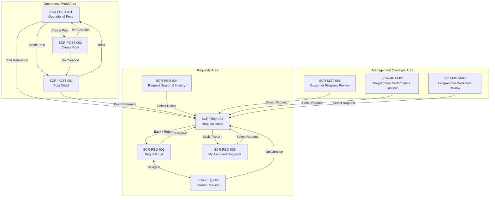

# CAKRA - ICS Operational Navigation Map

Derived from approved **User Journeys**, **Use Cases**, **Operational Scenarios**, **Actor Model**, and **Domain Models** using the **Navigation Creation Skill** (`operational/navigation/navigation-creation-skill.md`).

---

## 1. Overview and Structural Principles

Navigation defines the destinations available to actors and the paths used to move between them. Following the **Navigation Creation Skill**:

1. **User Journey Is Primary:** Every destination directly satisfies one or more approved user journeys.
2. **Strict Traceability:** Every screen traces through `User Journey → Use Case → Operational Scenario → Domain`.
3. **No Orphan Screens & No Inventions:** Destinations exist only for approved operational artifacts.
4. **No Duplicate Screens:** Shared destinations (such as `SCR-REQ-003: Request Detail`) are reused across journeys.
5. **Separation from Behavior and UI Layout:** Navigation answers only **where the actor can go and how they move between destinations**. It does not specify internal business logic, lifecycle state machines, processing rules, UI layout components, or styling.

---

## 2. Navigation Hierarchy Tree

```text
CAKRA - ICS Operational System
│
├── Operational Feed Area
│   ├── Operational Feed (SCR-FEED-001)
│   │   ├── Post Detail (SCR-POST-001)
│   │   │   └── Request Detail (SCR-REQ-003)
│   │   └── Create Post (SCR-POST-002)
│
├── Requests Area
│   ├── Request List (SCR-REQ-001)
│   │   ├── Create Request (SCR-REQ-002)
│   │   └── Request Detail (SCR-REQ-003)
│   ├── My Assigned Requests (SCR-REQ-005)
│   │   └── Request Detail (SCR-REQ-003)
│   └── Request Search & History (SCR-REQ-004)
│       └── Request Detail (SCR-REQ-003)
│
└── Management Oversight Area
    ├── Customer Progress Review (SCR-MGT-001)
    │   └── Request Detail (SCR-REQ-003)
    ├── Programmer Performance Review (SCR-MGT-002)
    │   └── Request Detail (SCR-REQ-003)
    └── Programmer Workload Review (SCR-MGT-003)
        └── Request Detail (SCR-REQ-003)
```

---

## 3. Navigation Areas and Destinations

### Area: Operational Feed

Contains destinations for observing operational activity, participating in discussions, and creating operational communications.

* **Primary Actors:** Implementator, Management, Request Owner
* **Destinations:**
  * **`SCR-FEED-001`: Operational Feed**
    * *Purpose:* Primary workspace for observing and participating in operational activity.
    * *Entry Points:* Global Navigation (`Operational Feed` — primary), System Default Landing.
    * *Exit / Destinations:* `SCR-POST-001: Post Detail`, `SCR-POST-002: Create Post`, `SCR-REQ-003: Request Detail` (via Post Reference).
  * **`SCR-POST-001`: Post Detail**
    * *Purpose:* Focused view of a single Post and its complete discussion thread.
    * *Entry Points:* `SCR-FEED-001` (select Post), Direct Link / Permanent Link.
    * *Exit / Destinations:* `SCR-FEED-001: Operational Feed`, `SCR-REQ-003: Request Detail` (via Post Reference).
  * **`SCR-POST-002`: Create Post**
    * *Purpose:* Author a new operational Post.
    * *Entry Points:* `SCR-FEED-001` (create action), `SCR-REQ-003: Request Detail` (create Post referencing current Request).
    * *Exit / Destinations:* `SCR-FEED-001: Operational Feed`, `SCR-POST-001: Post Detail`.

---

### Area 1: Requests

Contains destinations for viewing, searching, creating, and inspecting Request records.

* **Primary Actors:** Implementator, Request Owner
* **Destinations:**
  * **`SCR-REQ-001`: Request List**
    * *Purpose:* View and locate Requests within the system.
    * *Entry Points:* Global Navigation (`Requests > All Requests`).
    * *Exit / Destinations:* `SCR-REQ-002: Create Request`, `SCR-REQ-003: Request Detail`.
  * **`SCR-REQ-002`: Create Request**
    * *Purpose:* Record and submit a new Request.
    * *Entry Points:* `SCR-REQ-001: Request List`, Global Action (`+ New Request`).
    * *Exit / Destinations:* `SCR-REQ-001: Request List`, `SCR-REQ-003: Request Detail`.
  * **`SCR-REQ-003`: Request Detail**
    * *Purpose:* View and interact with a specific Request record.
    * *Entry Points:* `SCR-REQ-001`, `SCR-REQ-002`, `SCR-REQ-004`, `SCR-REQ-005`, `SCR-MGT-001`, `SCR-MGT-002`, `SCR-MGT-003`, Direct Link.
    * *Exit / Destinations:* `SCR-REQ-001: Request List`, `SCR-REQ-005: My Assigned Requests`, Originating Screen.
  * **`SCR-REQ-004`: Request Search & History**
    * *Purpose:* Search and retrieve historical Request records.
    * *Entry Points:* Global Navigation (`Requests > Search & History`), `SCR-REQ-001`.
    * *Exit / Destinations:* `SCR-REQ-003: Request Detail`.
  * **`SCR-REQ-005`: My Assigned Requests**
    * *Purpose:* View Requests assigned to the current user.
    * *Entry Points:* Global Navigation (`Requests > My Assigned`).
    * *Exit / Destinations:* `SCR-REQ-003: Request Detail`.

---

### Area 2: Management Oversight

Contains destinations for reviewing operational request progress, performance records, and workload distributions across customers and programmers.

* **Primary Actors:** Management
* **Destinations:**
  * **`SCR-MGT-001`: Customer Progress Review**
    * *Purpose:* View Request progress associated with a Customer.
    * *Entry Points:* Global Navigation (`Management > Customer Progress`).
    * *Exit / Destinations:* `SCR-REQ-003: Request Detail`.
  * **`SCR-MGT-002`: Programmer Performance Review**
    * *Purpose:* View historical Request outcomes for a Programmer.
    * *Entry Points:* Global Navigation (`Management > Programmer Performance`).
    * *Exit / Destinations:* `SCR-REQ-003: Request Detail`.
  * **`SCR-MGT-003`: Programmer Workload Review**
    * *Purpose:* View active Request assignments for a Programmer.
    * *Entry Points:* Global Navigation (`Management > Programmer Workload`).
    * *Exit / Destinations:* `SCR-REQ-003: Request Detail`.

---

## 4. Navigation Graph and Movement Paths



### Movement Descriptions

* **From Request List (`SCR-REQ-001`)**:
  * Navigate to `SCR-REQ-002: Create Request` to enter a new Request.
  * Select a Request to navigate to `SCR-REQ-003: Request Detail`.
* **From Create Request (`SCR-REQ-002`)**:
  * Return to `SCR-REQ-001: Request List` or proceed to `SCR-REQ-003: Request Detail`.
* **From My Assigned Requests (`SCR-REQ-005`)**:
  * Select an assigned Request to navigate to `SCR-REQ-003: Request Detail`.
* **From Request Search & History (`SCR-REQ-004`)**:
  * Select a search result to navigate to `SCR-REQ-003: Request Detail`.
* **From Customer Progress Review (`SCR-MGT-001`)**:
  * Select an associated Request to navigate to `SCR-REQ-003: Request Detail`.
* **From Programmer Performance Review (`SCR-MGT-002`)**:
  * Select a completed or historical Request to navigate to `SCR-REQ-003: Request Detail`.
* **From Programmer Workload Review (`SCR-MGT-003`)**:
  * Select an active Request to navigate to `SCR-REQ-003: Request Detail`.
* **From Request Detail (`SCR-REQ-003`)**:
  * Return to originating screen (`SCR-REQ-001`, `SCR-REQ-005`, `SCR-REQ-004`, or management screens).

---

## 5. End-to-End Traceability Matrix

Every screen in this navigation map traces directly to approved operational artifacts:

| Screen ID | Screen Name | User Journey | Use Case | Operational Scenario | Primary Actor | Related Domains |
| :--- | :--- | :--- | :--- | :--- | :--- | :--- |
| **SCR-FEED-001** | Operational Feed | UJ-AWR-001, UJ-AWR-002, UJ-AWR-003, UJ-FCOL-001, UJ-FCOL-002, UJ-FCOL-005 | UC-AWR-001, UC-AWR-002, UC-AWR-003, UC-FCOL-001, UC-FCOL-002, UC-FCOL-005 | SC-AWR-001, SC-AWR-002, SC-AWR-003, SC-FCOL-001, SC-FCOL-002, SC-FCOL-005 | All Actors | Post, Request, Customer, Product |
| **SCR-POST-001** | Post Detail | UJ-FCOL-001, UJ-FCOL-002, UJ-FCOL-004 | UC-FCOL-001, UC-FCOL-002, UC-FCOL-004 | SC-FCOL-001, SC-FCOL-002, SC-FCOL-004 | All Actors | Post, Request |
| **SCR-POST-002** | Create Post | UJ-FCOL-003 | UC-FCOL-003 | SC-FCOL-003 | Implementator | Post |
| **SCR-REQ-001** | Request List | UJ-REQ-002<br/>UJ-REQ-008<br/>UJ-COL-003 | UC-REQ-002<br/>UC-REQ-008<br/>UC-COL-003 | SC-REQ-002<br/>SC-REQ-008<br/>SC-COL-003 | Implementator<br/>Request Owner | Request, Customer, Organization |
| **SCR-REQ-002** | Create Request | UJ-REQ-001 | UC-REQ-001 | SC-REQ-001 | Implementator | Request, Customer, Product, Work Package |
| **SCR-REQ-003** | Request Detail | UJ-REQ-002<br/>UJ-REQ-003<br/>UJ-REQ-004<br/>UJ-REQ-005<br/>UJ-REQ-006<br/>UJ-REQ-007<br/>UJ-REQ-008<br/>UJ-COL-001<br/>UJ-COL-003<br/>UJ-MGT-001 | UC-REQ-002<br/>UC-REQ-003<br/>UC-REQ-004<br/>UC-REQ-005<br/>UC-REQ-006<br/>UC-REQ-007<br/>UC-REQ-008<br/>UC-COL-001<br/>UC-COL-003<br/>UC-MGT-001 | SC-REQ-002<br/>SC-REQ-003<br/>SC-REQ-004<br/>SC-REQ-005<br/>SC-REQ-006<br/>SC-REQ-007<br/>SC-REQ-008<br/>SC-COL-001<br/>SC-COL-003<br/>SC-MGT-001 | Implementator<br/>Request Owner<br/>Management | Request, Post, Customer, Organization, Product |
| **SCR-REQ-004** | Request Search & History | UJ-COL-002 | UC-COL-002 | SC-COL-002 | Implementator | Request, Customer, Product |
| **SCR-REQ-005** | My Assigned Requests | UJ-COL-004 | UC-COL-004 | SC-COL-004 | Implementator<br/>Request Owner | Request, Organization |
| **SCR-MGT-001** | Customer Progress Review | UJ-MGT-002 | UC-MGT-002 | SC-MGT-002 | Management | Request, Customer |
| **SCR-MGT-002** | Programmer Performance Review | UJ-MGT-003 | UC-MGT-003 | SC-MGT-003 | Management | Request, Organization |
| **SCR-MGT-003** | Programmer Workload Review | UJ-MGT-004 | UC-MGT-004 | SC-MGT-004 | Management | Request, Organization |

---

## 6. Validation Checklist

Verification against the **Navigation Creation Skill** checklist:

* [x] **Every screen maps to a User Journey:** All 11 screens directly satisfy at least one approved user journey.
* [x] **Every screen maps to a Use Case:** All screens trace directly to approved use cases.
* [x] **Every screen maps to an Operational Scenario:** All use cases are anchored in approved operational scenarios.
* [x] **No new business concepts introduced:** Structure reflects only approved domain concepts (Request, Customer, Organization, Post, Product).
* [x] **No duplicate screens exist:** Multi-journey interactions consolidate into `SCR-REQ-003: Request Detail`.
* [x] **No orphan screens exist:** Every screen has defined entry points and outgoing destinations.
* [x] **Navigation contains only structural information:** Exclusively defines areas, destinations, workspaces, and movement paths.
* [x] **UI decisions and business behavior are absent:** Zero references to lifecycle state machines, business processing logic, visual styling, or component layout.
