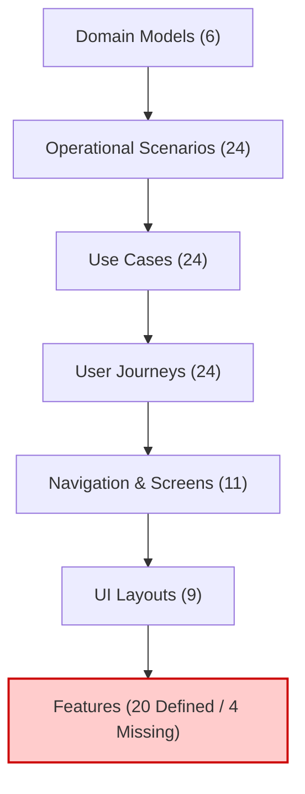
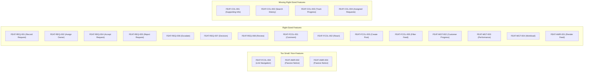

# Feature Review & Validation Report

**Subject:** Operational Feature Artifacts in [`operational/features/`](file:///d:/Project.Aktif/b20-agentic-dev/operational/features)  
**Evaluation Standard:** [`operational/features/feature-review-skill.md`](file:///d:/Project.Aktif/b20-agentic-dev/operational/features/feature-review-skill.md)  
**Audit Date:** 2026-09-27  
**Review Status:** ❌ **REJECTED — REMEDIATION REQUIRED**

---

## 1. Executive Summary

This evaluation validates the 20 discovered Feature artifacts in [`operational/features/`](file:///d:/Project.Aktif/b20-agentic-dev/operational/features) against approved upstream operational design artifacts ([`operational/domains/`](file:///d:/Project.Aktif/b20-agentic-dev/operational/domains), [`operational/scenarios/`](file:///d:/Project.Aktif/b20-agentic-dev/operational/scenarios), [`operational/use-cases/`](file:///d:/Project.Aktif/b20-agentic-dev/operational/use-cases), [`operational/user-journey/`](file:///d:/Project.Aktif/b20-agentic-dev/operational/user-journey), [`operational/navigation/`](file:///d:/Project.Aktif/b20-agentic-dev/operational/navigation), and [`operational/ui-layout/`](file:///d:/Project.Aktif/b20-agentic-dev/operational/ui-layout)) following the rules specified in [`feature-review-skill.md`](file:///d:/Project.Aktif/b20-agentic-dev/operational/features/feature-review-skill.md).

### High-Level Verdict
The feature baseline **fails review** and is not ready for implementation planning due to three primary systemic failures:
1. **Critical Coverage Omission:** An entire domain cluster—**Request Collaboration (`COL`)** consisting of 4 Use Cases, 4 User Journeys, and 2 dedicated UI screens—was omitted from [`feature-catalog.md`](file:///d:/Project.Aktif/b20-agentic-dev/operational/features/feature-catalog.md) despite false assertions of complete coverage in [`feature-coverage-validation.md`](file:///d:/Project.Aktif/b20-agentic-dev/operational/features/feature-coverage-validation.md).
2. **Screen Misalignment:** Key command features trace to incorrect UI screens where the capability is not present in the UI Layout.
3. **Duplication and Under-Sizing:** Redundant features duplicate state mutations (`FEAT-REQ-002` vs `FEAT-MGT-001`), simple hyperlink navigations are incorrectly elevated to features (`FEAT-FCOL-004`), and passive feed observation is split into redundant features (`FEAT-AWR-001`, `002`, `003`).

---

## 2. Review 1: Traceability Validation

### Lineage Audit Matrix

| Feature ID | Feature Name | Domain | Scenario | Use Case | Journey | Screen | Audit Result |
| :--- | :--- | :--- | :--- | :--- | :--- | :--- | :--- |
| [`FEAT-FCOL-001`](file:///d:/Project.Aktif/b20-agentic-dev/operational/features/FEAT-FCOL-001-comment-on-post.md) | Comment on Post | Post | SC-FCOL-001 | UC-FCOL-001 | UJ-FCOL-001 | SCR-FEED-001 | **VALID** (Also supported on SCR-POST-001) |
| [`FEAT-FCOL-002`](file:///d:/Project.Aktif/b20-agentic-dev/operational/features/FEAT-FCOL-002-react-to-post.md) | React to Post | Post | SC-FCOL-002 | UC-FCOL-002 | UJ-FCOL-002 | SCR-FEED-001 | **VALID** (Also supported on SCR-POST-001) |
| [`FEAT-FCOL-003`](file:///d:/Project.Aktif/b20-agentic-dev/operational/features/FEAT-FCOL-003-create-operational-post.md) | Create Operational Post | Post | SC-FCOL-003 | UC-FCOL-003 | UJ-FCOL-003 | SCR-FEED-001 | ⚠️ **SCREEN MISALIGNMENT** (Screen is SCR-POST-002) |
| [`FEAT-FCOL-004`](file:///d:/Project.Aktif/b20-agentic-dev/operational/features/FEAT-FCOL-004-navigate-from-post-to-request.md) | Navigate from Post to Request | Request | SC-FCOL-004 | UC-FCOL-004 | UJ-FCOL-004 | SCR-FEED-001 | ⚠️ **DOMAIN TRUNCATION** (Post, Request); Navigation link |
| [`FEAT-FCOL-005`](file:///d:/Project.Aktif/b20-agentic-dev/operational/features/FEAT-FCOL-005-filter-operational-feed.md) | Filter Operational Feed | Post | SC-FCOL-005 | UC-FCOL-005 | UJ-FCOL-005 | SCR-FEED-001 | ⚠️ **DOMAIN TRUNCATION** (Post, Customer, Product, Org) |
| [`FEAT-MGT-001`](file:///d:/Project.Aktif/b20-agentic-dev/operational/features/FEAT-MGT-001-reassign-request-ownership.md) | Reassign Request Ownership | Request | SC-MGT-001 | UC-MGT-001 | UJ-MGT-001 | SCR-REQ-003 | **VALID** (Merge candidate with FEAT-REQ-002) |
| [`FEAT-MGT-002`](file:///d:/Project.Aktif/b20-agentic-dev/operational/features/FEAT-MGT-002-review-customer-request-progress.md) | Review Customer Request Progress | Request | SC-MGT-002 | UC-MGT-002 | UJ-MGT-002 | SCR-MGT-001 | ⚠️ **DOMAIN TRUNCATION** (Request, Customer) |
| [`FEAT-MGT-003`](file:///d:/Project.Aktif/b20-agentic-dev/operational/features/FEAT-MGT-003-review-programmer-performance.md) | Review Programmer Performance | Request | SC-MGT-003 | UC-MGT-003 | UJ-MGT-003 | SCR-MGT-002 | ⚠️ **DOMAIN TRUNCATION** (Request, Org); UC title mismatch |
| [`FEAT-MGT-004`](file:///d:/Project.Aktif/b20-agentic-dev/operational/features/FEAT-MGT-004-review-programmer-workload.md) | Review Programmer Workload | Request | SC-MGT-004 | UC-MGT-004 | UJ-MGT-004 | SCR-MGT-003 | ⚠️ **DOMAIN TRUNCATION** (Request, Org) |
| [`FEAT-AWR-001`](file:///d:/Project.Aktif/b20-agentic-dev/operational/features/FEAT-AWR-001-observe-operational-feed.md) | Observe Operational Feed | Post | SC-AWR-001 | UC-AWR-001 | UJ-AWR-001 | SCR-FEED-001 | **VALID** |
| [`FEAT-AWR-002`](file:///d:/Project.Aktif/b20-agentic-dev/operational/features/FEAT-AWR-002-discover-request-via-feed.md) | Discover Request via Feed | Request | SC-AWR-002 | UC-AWR-002 | UJ-AWR-002 | SCR-FEED-001 | ⚠️ **DOMAIN TRUNCATION** (Post, Request); Observation scenario |
| [`FEAT-AWR-003`](file:///d:/Project.Aktif/b20-agentic-dev/operational/features/FEAT-AWR-003-monitor-operational-exceptions.md) | Monitor Operational Exceptions | Request | SC-AWR-003 | UC-AWR-003 | UJ-AWR-003 | SCR-FEED-001 | ⚠️ **DOMAIN TRUNCATION** (Post, Request); Observation scenario |
| [`FEAT-REQ-001`](file:///d:/Project.Aktif/b20-agentic-dev/operational/features/FEAT-REQ-001-record-customer-request.md) | Record Customer Request | Request | SC-REQ-001 | UC-REQ-001 | UJ-REQ-001 | SCR-REQ-001 | ❌ **SCREEN MISALIGNMENT** (Screen is SCR-REQ-002) |
| [`FEAT-REQ-002`](file:///d:/Project.Aktif/b20-agentic-dev/operational/features/FEAT-REQ-002-assign-request-owner.md) | Assign Request Owner | Request | SC-REQ-002 | UC-REQ-002 | UJ-REQ-002 | SCR-REQ-003 | **VALID** (Merge candidate with FEAT-MGT-001) |
| [`FEAT-REQ-003`](file:///d:/Project.Aktif/b20-agentic-dev/operational/features/FEAT-REQ-003-evaluate-request.md) | Evaluate Request | Request | SC-REQ-003 | UC-REQ-003 | UJ-REQ-003 | SCR-REQ-003 | **VALID** |
| [`FEAT-REQ-004`](file:///d:/Project.Aktif/b20-agentic-dev/operational/features/FEAT-REQ-004-accept-request-responsibility.md) | Accept Request Responsibility | Request | SC-REQ-004 | UC-REQ-004 | UJ-REQ-004 | SCR-REQ-003 | **VALID** |
| [`FEAT-REQ-005`](file:///d:/Project.Aktif/b20-agentic-dev/operational/features/FEAT-REQ-005-reject-request.md) | Reject Request | Request | SC-REQ-005 | UC-REQ-005 | UJ-REQ-005 | SCR-REQ-003 | **VALID** |
| [`FEAT-REQ-006`](file:///d:/Project.Aktif/b20-agentic-dev/operational/features/FEAT-REQ-006-escalate-request.md) | Escalate Request | Request | SC-REQ-006 | UC-REQ-006 | UJ-REQ-006 | SCR-REQ-003 | **VALID** |
| [`FEAT-REQ-007`](file:///d:/Project.Aktif/b20-agentic-dev/operational/features/FEAT-REQ-007-request-management-decision.md) | Request Management Decision | Request | SC-REQ-007 | UC-REQ-007 | UJ-REQ-007 | SCR-REQ-003 | **VALID** (Domain also Org) |
| [`FEAT-REQ-008`](file:///d:/Project.Aktif/b20-agentic-dev/operational/features/FEAT-REQ-008-review-request-completion.md) | Review Request Completion | Request | SC-REQ-008 | UC-REQ-008 | UJ-REQ-008 | SCR-REQ-003 | **VALID** (Also supported on SCR-REQ-001) |

### Specific Traceability Defects

1. **`FEAT-REQ-001` Target Screen Error:**
   - Feature lists `SCR-REQ-001` (Request List).
   - In [`operational/ui-layout/14-scr-req-002.md`](file:///d:/Project.Aktif/b20-agentic-dev/operational/ui-layout/14-scr-req-002.md) and [`screen-inventory.md`](file:///d:/Project.Aktif/b20-agentic-dev/operational/navigation/screen-inventory.md#L58-L82), request recording occurs strictly on **`SCR-REQ-002: Create Request`**. Mapping creation to the list grid is an erroneous screen link.
2. **`FEAT-FCOL-003` Target Screen Error:**
   - Feature lists `SCR-FEED-001` (Operational Feed).
   - Layout [`10-scr-feed-001.md`](file:///d:/Project.Aktif/b20-agentic-dev/operational/ui-layout/10-scr-feed-001.md) defines Feed Filters and Feed Stream, but contains no post creation controls. Navigation artifacts explicitly assign post creation to **`SCR-POST-002: Create Post`**.
3. **Multi-Domain Truncation:**
   - Upstream use cases consistently document cross-domain relationships (e.g., `UC-REQ-001` references `Request, Customer`; `UC-FCOL-005` references `Post, Customer, Product, Organization`). The feature files truncated these to a single primary domain, discarding vital business context.

---

## 3. Review 2: Coverage Validation

> [!CAUTION]
> **Defect: Total Omission of Collaboration Domain (`COL`)**  
> While [`feature-coverage-validation.md`](file:///d:/Project.Aktif/b20-agentic-dev/operational/features/feature-coverage-validation.md) marked `Every Use Case has Feature coverage` as checked, 4 upstream Use Cases and 4 User Journeys are completely unrepresented in the feature baseline.

### Missing Use Cases (`UNCOVERED USE CASE`)
From [`operational/use-cases/collaboration-use-cases.md`](file:///d:/Project.Aktif/b20-agentic-dev/operational/use-cases/collaboration-use-cases.md):
- 🚩 `UNCOVERED USE CASE`: **`UC-COL-001: Record Supporting Information`**
  - *Actor:* Implementator | *Domain:* Request, Post | *Screen:* `SCR-REQ-003`
- 🚩 `UNCOVERED USE CASE`: **`UC-COL-002: Search Request History`**
  - *Actor:* Implementator | *Domain:* Request | *Screen:* `SCR-REQ-004`
- 🚩 `UNCOVERED USE CASE`: **`UC-COL-003: Track Request Progress`**
  - *Actor:* Implementator | *Domain:* Request | *Screen:* `SCR-REQ-001`, `SCR-REQ-003`
- 🚩 `UNCOVERED USE CASE`: **`UC-COL-004: Review Assigned Requests`**
  - *Actor:* Implementator | *Domain:* Request, Organization | *Screen:* `SCR-REQ-005`

### Missing User Journeys (`UNCOVERED JOURNEY`)
From [`operational/user-journey/collaboration-user-journeys.md`](file:///d:/Project.Aktif/b20-agentic-dev/operational/user-journey/collaboration-user-journeys.md):
- 🚩 `UNCOVERED JOURNEY`: **`UJ-COL-001: Record Supporting Information`**
- 🚩 `UNCOVERED JOURNEY`: **`UJ-COL-002: Search Request History`**
- 🚩 `UNCOVERED JOURNEY`: **`UJ-COL-003: Track Request Progress`**
- 🚩 `UNCOVERED JOURNEY`: **`UJ-COL-004: Review Assigned Requests`**

### Missing Screen Interactions (`UNCOVERED INTERACTION`)
Because `COL` use cases were omitted, entire screens designed in [`operational/ui-layout/`](file:///d:/Project.Aktif/b20-agentic-dev/operational/ui-layout) have **zero feature backing**:
- 🚩 `UNCOVERED INTERACTION`: **[`SCR-REQ-004: Request Search & History`](file:///d:/Project.Aktif/b20-agentic-dev/operational/ui-layout/16-scr-req-004.md)** — Filter History, Quick Search, View Historical Record.
- 🚩 `UNCOVERED INTERACTION`: **[`SCR-REQ-005: My Assigned Requests`](file:///d:/Project.Aktif/b20-agentic-dev/operational/ui-layout/17-scr-req-005.md)** — Filter Assigned, Open Request Detail.
- 🚩 `UNCOVERED INTERACTION`: **[`SCR-REQ-003: Request Detail`](file:///d:/Project.Aktif/b20-agentic-dev/operational/ui-layout/15-scr-req-003.md)** — "Section: Supporting Information & Activity" (attaching notes/posts).

---

## 4. Review 3: Duplication Analysis

### Merge Candidates

#### Candidate 1: Request Ownership Mutation
- **Features:** `FEAT-REQ-002: Assign Request Owner` & `FEAT-MGT-001: Reassign Request Ownership`
- **Recommendation:** `MERGE CANDIDATE`
- **Reasoning:** In accordance with Principle 6 and the skill's explicit example (`Assign Request Owner` vs `Change/Update Request Owner`), both features represent the exact same state mutation: setting `Request.assignedImplementator`. Initial triage assignment (`UC-REQ-002`) and managerial reassignment (`UC-MGT-001`) differ only in role authorization and lifecycle timing. They should be unified into a single feature **`FEAT-REQ-002: Assign / Reassign Request Owner`** with role-based validation rules.

#### Candidate 2: Passive Feed Observation
- **Features:** `FEAT-AWR-001: Observe Operational Feed`, `FEAT-AWR-002: Discover Request via Feed`, `FEAT-AWR-003: Monitor Operational Exceptions`
- **Recommendation:** `MERGE CANDIDATE`
- **Reasoning:** `FEAT-AWR-001` provides the capability to render and display the feed stream. `FEAT-AWR-002` (noticing a request event post) and `FEAT-AWR-003` (noticing an exception post) are **cognitive user scenarios / observational outcomes**, not separate system capabilities. The feed item rendering with badges and metadata belongs to `FEAT-AWR-001`, and context filtering belongs to `FEAT-FCOL-005`. Retaining them as independent system features fragments feed implementation.

---

## 5. Review 4: Feature Size Validation

Features are classified according to whether they represent an independently implementable system capability:

### 1. Too Small / Granular (Non-Features)
- **`FEAT-FCOL-004: Navigate from Post to Request`**: Clicking a link from a post reference to the Request Detail screen is a standard UI navigation affordance (hyperlink / route transition), not an independent operational feature. Subsume under `FEAT-AWR-001`.
- **`FEAT-AWR-002` & `FEAT-AWR-003`**: Passive observation outcomes without distinct backend mutations or UI widgets. Subsume under `FEAT-AWR-001`.

### 2. Ambiguous Sizing
- **`FEAT-REQ-003: Evaluate Request`**: `UC-REQ-003` describes the Request Owner inspecting demand details on `SCR-REQ-003`. If this represents merely opening the detail screen, it conflates a screen view with a feature (violating Principle 5). It should be refactored to focus specifically on the triage evaluation decision workflow.

### 3. Missing Right-Sized Features
Four right-sized features corresponding to `UC-COL-001` through `UC-COL-004` must be authored.

---

## 6. Review 5: Principle Compliance & Implementation-Readiness Assessment

| Principle | Rule Description | Compliance | Evidence / Findings |
| :--- | :--- | :---: | :--- |
| **Principle 1** | Originates from approved Use Cases | **PASS** | All 20 features trace to an existing Use Case. |
| **Principle 2** | Supports approved User Journeys | **PASS** | All 20 features trace to an existing User Journey. |
| **Principle 3** | Observable through approved Screen | **FAIL** | `FEAT-REQ-001` and `FEAT-FCOL-003` map to screens lacking the required controls. |
| **Principle 4** | Implementation-independent | **PASS** | Zero prohibited terms (`API`, `Controller`, `SQL`, `Kafka`, etc.). |
| **Principle 5** | Features are not Screens | **PASS** | No features named after screens. |
| **Principle 6** | Features are not Domains | **PASS** | No features named after domains. |

### Specification Quality & Implementation-Readiness Defect
> [!WARNING]
> **Mechanical Boilerplate Syndrome:**  
> All 20 `FEAT-*.md` files are identical structural copies where only title and IDs were altered:
> - **Business Rules:** Purely abstract statement: *"Execution must comply with constraints defined in the related domain and operational scenario. Proper authorization must be enforced."* Zero concrete validation rules, state invariants, or domain constraints were specified.
> - **Failure Conditions:** Identical generic 3-bullet list across all files.
> - **Acceptance Criteria:** Identical unchecked template checkboxes.
> - **Implementation Notes:** `"None."` across all 20 files.
>
> In their current state, these files cannot guide engineering slices without developers manually re-deriving domain rules from scratch.

---

## 7. Remediation Action Plan

To transition the feature baseline to **APPROVED** status, execute the following steps:

1. **Author the Missing Collaboration Features (`COL`):**
   - Create [`FEAT-COL-001-record-supporting-information.md`](file:///d:/Project.Aktif/b20-agentic-dev/operational/features/) (`UC-COL-001`, `UJ-COL-001`, `SCR-REQ-003`).
   - Create [`FEAT-COL-002-search-request-history.md`](file:///d:/Project.Aktif/b20-agentic-dev/operational/features/) (`UC-COL-002`, `UJ-COL-002`, `SCR-REQ-004`).
   - Create [`FEAT-COL-003-track-request-progress.md`](file:///d:/Project.Aktif/b20-agentic-dev/operational/features/) (`UC-COL-003`, `UJ-COL-003`, `SCR-REQ-001` / `SCR-REQ-003`).
   - Create [`FEAT-COL-004-review-assigned-requests.md`](file:///d:/Project.Aktif/b20-agentic-dev/operational/features/) (`UC-COL-004`, `UJ-COL-004`, `SCR-REQ-005`).

2. **Correct Broken Traceability Links:**
   - Update [`FEAT-REQ-001`](file:///d:/Project.Aktif/b20-agentic-dev/operational/features/FEAT-REQ-001-record-customer-request.md): change screen mapping from `SCR-REQ-001` to `SCR-REQ-002`.
   - Update [`FEAT-FCOL-003`](file:///d:/Project.Aktif/b20-agentic-dev/operational/features/FEAT-FCOL-003-create-operational-post.md): update screen mapping to `SCR-POST-002` (and entry from `SCR-FEED-001`).
   - Restore multi-domain links across all feature files.

3. **Consolidate Redundancies:**
   - Merge `FEAT-MGT-001` into `FEAT-REQ-002` as `Assign / Reassign Request Owner`.
   - Subsume `FEAT-AWR-002` and `FEAT-AWR-003` into `FEAT-AWR-001` (Observe Operational Feed).
   - Reclassify `FEAT-FCOL-004` from a feature into a UI navigation link.

4. **Populate Real Business Rules:**
   - Populate each feature's `Business Rules`, `Failure Conditions`, and `Acceptance Criteria` with concrete rules extracted from the corresponding domain specifications in [`operational/domains/`](file:///d:/Project.Aktif/b20-agentic-dev/operational/domains).

5. **Regenerate Catalogs and Matrix:**
   - Regenerate [`feature-catalog.md`](file:///d:/Project.Aktif/b20-agentic-dev/operational/features/feature-catalog.md), [`feature-traceability.md`](file:///d:/Project.Aktif/b20-agentic-dev/operational/features/feature-traceability.md), and [`feature-coverage-validation.md`](file:///d:/Project.Aktif/b20-agentic-dev/operational/features/feature-coverage-validation.md).
