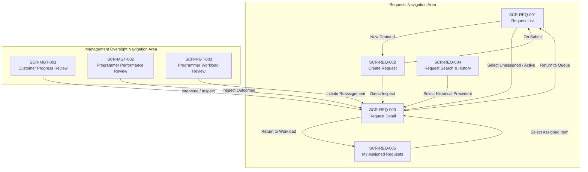

# ICS Operational Navigation Map

Derived from approved **User Journeys**, **Use Cases**, **Operational Scenarios**, **Actor Model**, and **Domain Models** using the **Navigation Creation Skill** (`operational/navigation/navigation-creation-skill.md`).

---

## 1. Overview and Structural Principles

Navigation exists solely to expose approved operational capabilities to actors. Following the **Navigation Creation Skill**:

1. **User Journey Is Primary:** Every destination directly satisfies one or more approved user journeys.
2. **Strict Traceability:** Every screen traces cleanly through `User Journey → Use Case → Operational Scenario → Domain`.
3. **No Orphan Screens & No Inventions:** No screens are created for capabilities, domains, or workflows not yet defined in approved scenarios and use cases.
4. **No Duplicate Screens:** Screens serving multiple journeys (such as `SCR-REQ-003: Request Detail`) are reused rather than duplicated.
5. **Structural Navigation Only:** Defines areas, destinations, workspaces, and transitions without prescribing UI layouts, styling, forms, or widget components.

---

## 2. Navigation Hierarchy Tree

```text
ICS Operational System
│
├── Requests (Core Operations Area)
│   ├── Request List (SCR-REQ-001)
│   │   ├── Create Request (SCR-REQ-002)
│   │   └── Request Detail (SCR-REQ-003)
│   ├── My Assigned Requests (SCR-REQ-005)
│   │   └── Request Detail (SCR-REQ-003)
│   └── Request Search & History (SCR-REQ-004)
│       └── Request Detail (SCR-REQ-003)
│
└── Management Oversight (Oversight Area)
    ├── Customer Progress Review (SCR-MGT-001)
    │   └── Request Detail (SCR-REQ-003)
    ├── Programmer Workload Review (SCR-MGT-003)
    │   └── Request Detail (SCR-REQ-003)
    └── Programmer Performance Review (SCR-MGT-002)
        └── Request Detail (SCR-REQ-003)
```

---

## 3. Navigation Areas and Destinations

### Area 1: Requests (Core Operations)

This area supports operational demand intake, ownership assignment, handler evaluation, active handling, resolution review, collaboration, and history search.

* **Primary Actors:** Implementator, Request Owner
* **Destinations:**
  * **`SCR-REQ-001`: Request List**
    * *Role:* Primary listing and operational triage queue for all recorded requests.
    * *Entry Point:* Global Navigation (`/requests`).
  * **`SCR-REQ-002`: Create Request**
    * *Role:* Demand intake destination to record new customer or internal requests.
    * *Entry Point:* Direct action from `SCR-REQ-001` or Global Action bar (`/requests/new`).
  * **`SCR-REQ-003`: Request Detail**
    * *Role:* Central operational workspace for evaluating, handling, escalating, resolving, reviewing, and collaborating on a specific request.
    * *Entry Point:* Accessible from `SCR-REQ-001`, `SCR-REQ-004`, `SCR-REQ-005`, management review screens, and permanent link (`/requests/:id`).
  * **`SCR-REQ-004`: Request Search & History**
    * *Role:* Exploration destination for searching past requests, resolutions, and precedents.
    * *Entry Point:* Global Navigation (`/requests/search`).
  * **`SCR-REQ-005`: My Assigned Requests**
    * *Role:* Personal operational queue for handlers to review items currently assigned to them.
    * *Entry Point:* Global Navigation (`/requests/my-assigned`).

---

### Area 2: Management Oversight

This area supports management monitoring of operational progress, workload distribution, performance evaluation, and governance interventions.

* **Primary Actors:** Management
* **Destinations:**
  * **`SCR-MGT-001`: Customer Progress Review**
    * *Role:* Customer-oriented operational monitoring destination to track request statuses, milestones, and blockers.
    * *Entry Point:* Global Navigation (`/management/customers`).
  * **`SCR-MGT-002`: Programmer Performance Review**
    * *Role:* Performance evaluation destination to analyze request throughput, completion rates, and resolution outcomes for programmers.
    * *Entry Point:* Global Navigation (`/management/performance`).
  * **`SCR-MGT-003`: Programmer Workload Review**
    * *Role:* Capacity and load assessment destination to monitor active assignment distribution and initiate rebalancing.
    * *Entry Point:* Global Navigation (`/management/workload`).

---

## 4. Navigation Flows by Operational Lifecycle



### Flow 1: Demand Capture and Ownership Assignment
1. Actor (Implementator) starts at **`SCR-REQ-001: Request List`**.
2. Actor triggers request creation, transitioning to **`SCR-REQ-002: Create Request`** (supporting `UJ-REQ-001`).
3. Upon submission, request enters `CAPTURED` state and is listed in **`SCR-REQ-001`**.
4. Actor opens the captured request in **`SCR-REQ-003: Request Detail`** to select an organization member and assign ownership (supporting `UJ-REQ-002`).

### Flow 2: Evaluation, Handling, and Lifecycle Transitions
1. Actor (Request Owner) accesses their assigned requests via **`SCR-REQ-005: My Assigned Requests`** (supporting `UJ-COL-004`) or **`SCR-REQ-001`**.
2. Actor navigates into **`SCR-REQ-003: Request Detail`**.
3. In **`SCR-REQ-003`**, actor evaluates feasibility (supporting `UJ-REQ-003`) and executes one of four operational transitions:
   * **Accept Responsibility:** Transitions request to `ACTIVE` (supporting `UJ-REQ-004`).
   * **Reject Request:** Records explanatory reason and transitions request to `CLOSED` (supporting `UJ-REQ-005`).
   * **Escalate Request:** Flags request for higher authority attention with escalation rationale (supporting `UJ-REQ-006`).
   * **Request Management Decision:** Documents decision question, risks, and options for management elevation (supporting `UJ-REQ-007`).

### Flow 3: Collaboration and Progress Tracking
1. Actor (Implementator or collaborator) navigates to **`SCR-REQ-003: Request Detail`** from **`SCR-REQ-001`** or **`SCR-REQ-005`**.
2. Actor adds observations, notes, or evidence attachments (supporting `UJ-COL-001`).
3. Actor inspects chronological milestone progress and step history (supporting `UJ-COL-003`).

### Flow 4: Historical Retrieval and Knowledge Precedent
1. Actor (Implementator) navigates to **`SCR-REQ-004: Request Search & History`**.
2. Actor executes multi-criteria search (keywords, customer, product, dates) (supporting `UJ-COL-002`).
3. Actor selects a matching historical record, opening **`SCR-REQ-003: Request Detail`** to review past resolution outcomes.

### Flow 5: Completion Verification and Closure
1. Request Owner marks work complete.
2. Actor (Implementator) locates completed request awaiting verification on **`SCR-REQ-001: Request List`**.
3. Actor navigates to **`SCR-REQ-003: Request Detail`** to review completed evidence (supporting `UJ-REQ-008`).
4. Actor either accepts resolution (request transitions to `CLOSED`) or returns it to Request Owner for rework.

### Flow 6: Management Oversight and Workload Balancing
1. Actor (Management) accesses **`SCR-MGT-001: Customer Progress Review`** to review requests by customer (supporting `UJ-MGT-002`), or **`SCR-MGT-003: Programmer Workload Review`** to inspect load capacity (supporting `UJ-MGT-004`), or **`SCR-MGT-002: Programmer Performance Review`** to evaluate throughput (supporting `UJ-MGT-003`).
2. When intervention or rebalancing is needed, Management navigates into **`SCR-REQ-003: Request Detail`** and executes ownership reassignment (supporting `UJ-MGT-001`).

---

## 5. End-to-End Traceability Matrix

Every screen in this navigation map maps 1:1 to approved operational artifacts:

| Screen ID | Screen Name | User Journey | Use Case | Operational Scenario | Primary Actor | Related Domains |
| :--- | :--- | :--- | :--- | :--- | :--- | :--- |
| **SCR-REQ-001** | Request List | UJ-REQ-002<br/>UJ-REQ-008<br/>UJ-COL-003 | UC-REQ-002<br/>UC-REQ-008<br/>UC-COL-003 | SC-REQ-002<br/>SC-REQ-008<br/>SC-COL-003 | Implementator<br/>Request Owner | Request, Customer, Organization |
| **SCR-REQ-002** | Create Request | UJ-REQ-001 | UC-REQ-001 | SC-REQ-001 | Implementator | Request, Customer, Product, Work Package |
| **SCR-REQ-003** | Request Detail | UJ-REQ-002<br/>UJ-REQ-003<br/>UJ-REQ-004<br/>UJ-REQ-005<br/>UJ-REQ-006<br/>UJ-REQ-007<br/>UJ-REQ-008<br/>UJ-COL-001<br/>UJ-COL-003<br/>UJ-MGT-001 | UC-REQ-002<br/>UC-REQ-003<br/>UC-REQ-004<br/>UC-REQ-005<br/>UC-REQ-006<br/>UC-REQ-007<br/>UC-REQ-008<br/>UC-COL-001<br/>UC-COL-003<br/>UC-MGT-001 | SC-REQ-002<br/>SC-REQ-003<br/>SC-REQ-004<br/>SC-REQ-005<br/>SC-REQ-006<br/>SC-REQ-007<br/>SC-REQ-008<br/>SC-COL-001<br/>SC-COL-003<br/>SC-MGT-001 | Implementator<br/>Request Owner<br/>Management | Request, Post, Customer, Organization, Product |
| **SCR-REQ-004** | Request Search & History | UJ-COL-002 | UC-COL-002 | SC-COL-002 | Implementator | Request, Customer, Product |
| **SCR-REQ-005** | My Assigned Requests | UJ-COL-004 | UC-COL-004 | SC-COL-004 | Implementator<br/>Request Owner | Request, Organization |
| **SCR-MGT-001** | Customer Progress Review | UJ-MGT-002 | UC-MGT-002 | SC-MGT-002 | Management | Request, Customer |
| **SCR-MGT-002** | Programmer Performance Review | UJ-MGT-003 | UC-MGT-003 | SC-MGT-003 | Management | Request, Organization |
| **SCR-MGT-003** | Programmer Workload Review | UJ-MGT-004 | UC-MGT-004 | SC-MGT-004 | Management | Request, Organization |

---

## 6. Validation Checklist

Verification against the **Navigation Creation Skill** checklist:

* [x] **Every screen maps to a User Journey:** All 8 screens directly satisfy at least one approved user journey.
* [x] **Every screen maps to a Use Case:** All screens trace directly to approved use cases.
* [x] **Every screen maps to an Operational Scenario:** All use cases are anchored in approved operational scenarios.
* [x] **No new business concepts introduced:** Structure reflects only approved domain concepts (Request, Customer, Organization, Post, Product).
* [x] **No duplicate screens exist:** Multi-journey interactions (evaluation, acceptance, rejection, escalation, review, notes, reassignment) are consolidated into `SCR-REQ-003: Request Detail`.
* [x] **No orphan screens exist:** Every screen has defined entry points and clear functional relevance to at least one use case.
* [x] **Navigation contains only structural information:** Exclusively defines areas, destinations, workspaces, and transitions.
* [x] **UI decisions are absent:** Zero references to visual styling, color codes, component widgets, or layout dimensions.
